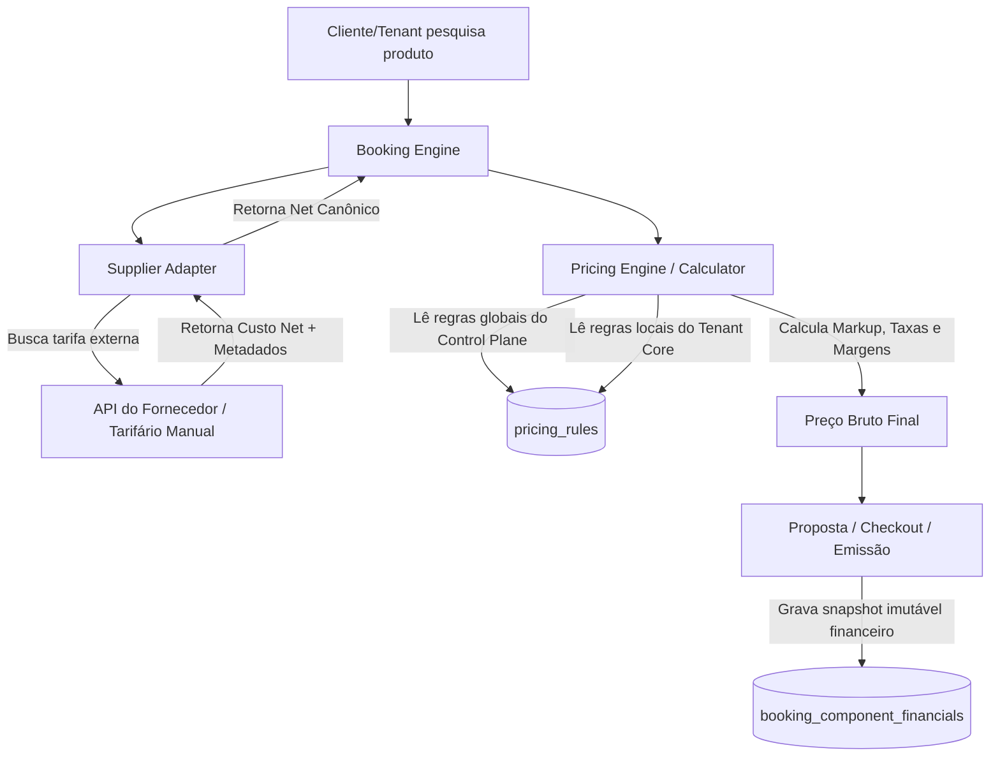

# Booking Engine & Pricing Architecture Design

Este documento especifica a arquitetura técnica e comercial para o motor de reservas (**Booking Engine**) e o motor de precificação (**Pricing Engine**) do ecossistema NORO Guru. 

Ele integra as definições do painel administrativo global ([apps/control](file:///C:/Users/paulo/0-dev/02-aplicacoes/04%20noro-guru/noro-guru/apps/control)) e do portal operacional do tenant ([apps/core](file:///C:/Users/paulo/0-dev/02-aplicacoes/04%20noro-guru/noro-guru/apps/core)), acomodando fornecedores via API da plataforma, fornecedores manuais globais e fornecedores próprios/offline dos tenants.

---

## 1. Princípios de Precificação: Net vs. Bruto

A comercialização de produtos turísticos na NORO Guru opera sob as seguintes premissas:
1. **Custo Net (Líquido)**: O custo real cobrado pelo fornecedor (seja via API como LiteAPI/Amadeus ou manual de acordo com tarifários offline).
2. **Preço Bruto (Venda)**: O valor final exposto ao cliente final (via propostas ou checkout).
3. **Comissão do Fornecedor**: Percentual ou valor fixo pago pelo fornecedor sobre a venda do produto (estimada e mínima).
4. **Markup**: O acréscimo comercial aplicado sobre o Net para compor o Bruto.
5. **Split Comercial**: Divisão do markup/comissão entre a plataforma NORO e o Tenant (agência/creator).

---

## 2. Fluxo de Dados e Separação de Responsabilidades

Para garantir que o motor seja escalável e suporte múltiplos fornecedores, o cálculo do **Preço Bruto** e das margens ocorre fora do adaptador da API. 

### 2.1 O Papel do Adapter (Fronteira Externa)
O **Adapter** comunica-se com a API do fornecedor e normaliza o retorno em um formato padrão do nosso Core. Ele é responsável exclusivamente por:
*   Realizar a busca (Search).
*   Retornar o **Custo Líquido (Net)** em sua moeda original.
*   Retornar metadados específicos (regra de cancelamento, ocupação, prazos).
*   **O Adapter não calcula markups de venda do tenant, taxas de remessa ou gateway.**

### 2.2 O Papel do Pricing Engine (Motor de Precificação)
A **Pricing Engine** é um serviço compartilhado no Core que recebe o Custo Net do Adapter e aplica a composição comercial:
1. **Determina o Escopo do Fornecedor**:
   *   **Fornecedor Global NORO**: Gerido em [apps/control](file:///C:/Users/paulo/0-dev/02-aplicacoes/04%20noro-guru/noro-guru/apps/control).
   *   **Fornecedor Próprio/Offline do Tenant**: Gerido em [apps/core](file:///C:/Users/paulo/0-dev/02-aplicacoes/04%20noro-guru/noro-guru/apps/core).
2. **Carrega as Regras de Preço (`pricing_rules`)**:
   *   Regras da Plataforma (ex: markup mínimo exigido pela NORO, taxa de gateway).
   *   Regras do Tenant (ex: markup comercial da agência por categoria ou canal).
3. **Faz a Conversão Cambial (se aplicável)**:
   *   Caso o Net seja em USD/EUR e a venda em BRL, consulta o serviço de câmbio da plataforma e aplica o câmbio com spread.
4. **Calcula o Preço de Venda (Bruto)**:
   *   $$Preço\ Bruto = Custo\ Net + Markup\ Tenant + Markup\ Plataforma + Taxas$$
5. **Calcula as Comissões**:
   *   **Comissão Estimada**: Comissão que o fornecedor promete pagar (retornada pela API ou configurada no cadastro).
   *   **Comissão Mínima / Margem de Segurança**: Verificação se a venda atende aos critérios mínimos de rentabilidade exigidos pelo Control Plane.

---

## 3. Estrutura de Banco de Dados Vigente

A precificação e as reservas utilizam as tabelas mapeadas em [packages/db/schema](file:///C:/Users/paulo/0-dev/02-aplicacoes/04%20noro-guru/noro-guru/packages/db/schema) de forma integrada:

### 3.1 Regras de Preço — [pricing-rules.ts](file:///C:/Users/paulo/0-dev/02-aplicacoes/04%20noro-guru/noro-guru/packages/db/schema/pricing-rules.ts)
Armazena as fórmulas de cálculo.
*   `escopo`: `'plataforma'` ou `'tenant'`.
*   `tipoRegra`: `'markup_percentual'`, `'markup_minimo_percentual'`, `'taxa_cartao_percentual'`, `'taxa_remessa_percentual'`, `'taxa_fixa_cents'`.
*   `valor`: O percentual ou centavos da regra.
*   `categoria`: Filtro opcional (aéreo, hotel, seguro, visto, etc.).

### 3.2 Registro Financeiro da Reserva — [booking-component-financials.ts](file:///C:/Users/paulo/0-dev/02-aplicacoes/04%20noro-guru/noro-guru/packages/db/schema/booking-component-financials.ts)
Snapshot de todos os cálculos realizados na precificação da reserva. **É imutável após o aceite da proposta.**
*   `supplierNetAmount` (Custo Net do Fornecedor).
*   `supplierCommissionAmount` (Comissão do fornecedor).
*   `markupAmount` (Soma dos markups aplicados).
*   `serviceFeeAmount` (Taxas adicionais do tenant).
*   `grossClientAmount` (Preço Bruto final de venda cobrado do passageiro).
*   `currency` (Moeda da cobrança).

---

## 4. Interfaces e Controle: Control vs. Core

A gestão comercial é distribuída de acordo com as permissões da plataforma:

| Painel | Responsabilidade | Funcionalidades de Preço |
| --- | --- | --- |
| **Control Plane** (`apps/control`) | Gestão de rede, billing SaaS e fornecedores globais | • Painel de custos de APIs Globais (custo net de referência). • Cadastro de comissão estimada/mínima dos contratos globais. • Definição de markup mínimo da plataforma. • Cadastro de taxas de remessa cambial e taxas de gateway da plataforma. |
| **Tenant Portal** (`apps/core`) | Operação local da agência / creator / consultor | • Definição de markups comerciais próprios (em cima dos custos net da NORO). • Cadastro e precificação de **fornecedores offline próprios** (receptivos locais, hotéis independentes). • Customização de taxas de serviço específicas por canal (agente, direto). |

---

## 5. Máquina de Estados do Booking Engine

Para garantir conformidade entre a precificação externa e a emissão, a reserva passa pelo seguinte fluxo de estados:

1.  **Draft / Quoted (Orçamento)**: 
    *   Tabela `pricing_rules` é lida de forma dinâmica.
    *   O preço de venda flutua conforme câmbio e regras dinâmicas.
2.  **Hold / Confirmed (Pré-Reserva com Bloqueio)**:
    *   O Custo Net é travado temporariamente pelo fornecedor (Hold / TTL).
    *   A **Pricing Engine** calcula o preço final e salva o snapshot em `booking_component_financials`. As regras dinâmicas param de ser aplicadas.
3.  **Paid (Pago)**:
    *   A confirmação de pagamento do Asaas libera o item para emissão.
4.  **Voucher Issued (Emitido)**:
    *   O adaptador chama a API de emissão (ex: ticketing da Amadeus ou LiteAPI).
    *   Os vouchers gerados são gravados em `normalizedSnapshot` de `booking_items`.
5.  **Cancelled (Cancelado)**:
    *   Processa regras de reembolso.
