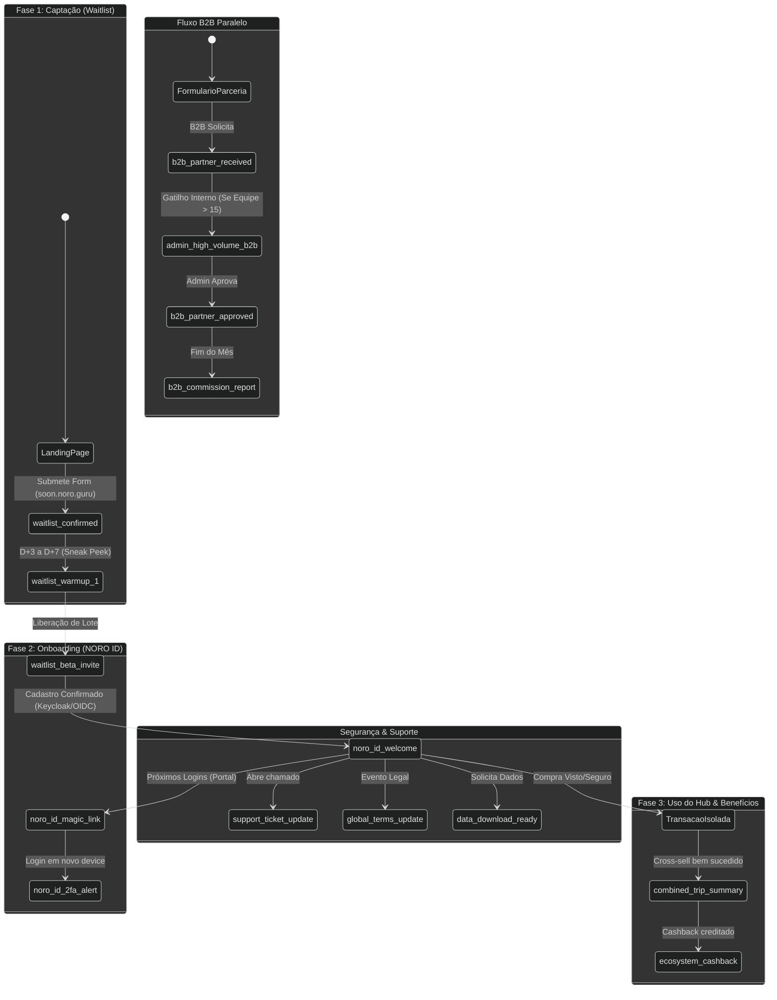

# Matriz de E-mails e Ciclo de Vida (NORO GURU)

Este documento centraliza o mapeamento exaustivo de todos os e-mails transacionais, operacionais e de ciclo de vida do ecossistema NORO GURU (incluindo `noro.guru`, `soon.noro.guru`, e plataformas satélites). A matriz cobre tanto fluxos físicos (já implementados no código) quanto projetados (lacunas visando a arquitetura alvo).

## Sumário Executivo

| Slug | Categoria | Status | Gatilho | Destinatário |
|---|---|---|---|---|
| `noro_id_magic_link` | Conta/Segurança | `[Físico / No Código]` | Formulário de Login (Portal) | Usuário |
| `admin_invite_user` | Admin | `[Físico / No Código]` | Convite no Control Plane | Novo Admin |
| `support_ticket_update` | Admin | `[Físico / No Código]` | Criação/Att de Ticket | Admin / Usuário |
| `waitlist_confirmed` | Waitlist/Growth | `[Físico / No Código]` | Cadastro na Soon Landing | Lead/Agência |
| `noro_id_welcome` | Conta/Segurança | `[Projetado / Lacuna]` | Criação da conta unificada | Usuário |
| `noro_id_2fa_alert` | Conta/Segurança | `[Projetado / Lacuna]` | Novo login suspeito/Novo IP | Usuário |
| `waitlist_warmup_1` | Waitlist/Growth | `[Projetado / Lacuna]` | D+3 após cadastro na waitlist | Lead/Agência |
| `waitlist_beta_invite`| Waitlist/Growth | `[Projetado / Lacuna]` | Liberação de lote Beta | Lead/Agência |
| `combined_trip_summary`| Hub Multi-Serviço | `[Projetado / Lacuna]` | Compra de Roteiro+Visto+Seguro | Usuário |
| `ecosystem_cashback` | Hub Multi-Serviço | `[Projetado / Lacuna]` | Cashback gerado na plataforma | Usuário |
| `global_terms_update` | Segurança Global | `[Projetado / Lacuna]` | Atualização de termos de uso | Todos os usuários |
| `data_download_ready` | Segurança Global | `[Projetado / Lacuna]` | Solicitação de exportação GDPR | Usuário |
| `b2b_partner_received`| B2B/Parcerias | `[Projetado / Lacuna]` | Formulário B2B enviado | Lead B2B |
| `b2b_partner_approved`| B2B/Parcerias | `[Projetado / Lacuna]` | Aprovação manual pela NORO | Agência/Afiliado |
| `b2b_commission_report`| B2B/Parcerias | `[Projetado / Lacuna]` | Fechamento mensal de faturas | Agência/Afiliado |
| `admin_high_volume_b2b`| Admin | `[Projetado / Lacuna]` | Cadastro B2B (tamanho 15+) | Admin NORO |
| `admin_system_health` | Admin | `[Projetado / Lacuna]` | Queda de métricas críticas | DevOps/Tech Lead |

## Fluxo do Ciclo de Vida (Mermaid)



## 1. Identidade Global & Conta Unificada (NORO ID)

### `noro_id_magic_link` `[Físico / No Código]`
- **Categoria:** Conta/Segurança
- **Gatilho Técnico:** `apps/portal/lib/magic-link.ts` (`requestMagicLink()`).
- **Momento do Disparo:** Imediato (ao tentar logar no Portal do Cliente).
- **Destinatário:** Usuário (B2C)
- **Objetivo de Negócio:** Acesso sem senha ("passwordless") reduzindo fricção com alta segurança.
- **Assunto:** Seu acesso seguro ao portal de viagens
- **Estrutura do Teor:**
  - **Headline:** Seu link de acesso chegou.
  - **Mensagem:** Um link exclusivo e temporário foi gerado para acessar sua conta. Clique no botão abaixo. Se você não solicitou, ignore.
  - **CTA:** "Acessar meu portal" (Botão Turquesa).
- **Payload de Variáveis JSON:**
```typescript
/** Payload para envio do Magic Link */
interface NoroIdMagicLinkPayload {
  /** Nome ou nome preferido do usuário */
  /** Valor correspondente ao campo nome */
  nome: string;
  /** Link seguro gerado com token de sessão único */
  /** Valor correspondente ao campo magicUrl */
  magicUrl: string;
  /** Nome da agência B2B que está fornecendo o acesso */
  /** Valor correspondente ao campo agencyDisplayName */
  agencyDisplayName: string;
}
```
*Exemplo JSON:*
```json
{
  "nome": "Fernando",
  "magicUrl": "https://portal.noro.guru/auth/verify?token=123xyz",
  "agencyDisplayName": "Viagem dos Sonhos"
}
```

### `noro_id_welcome` `[Projetado / Lacuna]`
- **Categoria:** Conta/Segurança
- **Gatilho Técnico:** Webhook do Logto/Keycloak ao criar identidade unificada no Realm `noro`.
- **Momento do Disparo:** Imediato, após verificação inicial de e-mail.
- **Destinatário:** Usuário
- **Objetivo de Negócio:** Consolidar a marca NORO ID. Transmitir o peso de que agora ele tem um "Passaporte Digital" global para Vistos, Seguros e Roteiros.
- **Assunto:** Bem-vindo à sua nova identidade de viagens globais
- **Estrutura do Teor:**
  - **Headline:** Você ativou seu NORO ID.
  - **Mensagem:** Bem-vindo ao ecossistema NORO. Agora você possui uma conta única de altíssima segurança (Padrão Bancário) para gerenciar roteiros, aprovar vistos e emitir seguros com 1 clique.
  - **CTA:** "Complete seu Perfil de Viajante" (Botão Gold).
- **Payload de Variáveis JSON:**
```typescript
interface NoroIdWelcomePayload {
  /** Valor correspondente ao campo nome */
  nome: string;
  /** Valor correspondente ao campo perfilUrl */
  perfilUrl: string;
}
```
*Exemplo JSON:*
```json
{
  "nome": "Carolina",
  "perfilUrl": "https://noro.guru/id/setup"
}
```

### `noro_id_2fa_alert` `[Projetado / Lacuna]`
- **Categoria:** Conta/Segurança
- **Gatilho Técnico:** Logto/Keycloak detecta novo IP, novo device ou tentativa de alteração de dados sensíveis.
- **Momento do Disparo:** Imediato.
- **Destinatário:** Usuário
- **Objetivo de Negócio:** Proteger o usuário e construir confiança institucional através de transparência em tempo real.
- **Assunto:** ⚠️ Novo acesso detectado em seu NORO ID
- **Estrutura do Teor:**
  - **Headline:** Notificação de Segurança.
  - **Mensagem:** Detectamos um login na sua conta a partir de um novo dispositivo. Se foi você, nenhuma ação é necessária.
  - **CTA:** "Não fui eu - Bloquear Conta" (Botão Red/Dark).
- **Payload de Variáveis JSON:**
```typescript
interface NoroId2faAlertPayload {
  /** Valor correspondente ao campo device */
  device: string;
  /** Valor correspondente ao campo location */
  location: string;
  /** Valor correspondente ao campo ipAddress */
  ipAddress: string;
  /** Valor correspondente ao campo timestamp */
  timestamp: string;
  /** Valor correspondente ao campo blockAccountUrl */
  blockAccountUrl: string;
}
```
*Exemplo JSON:*
```json
{
  "device": "MacBook Pro - Chrome",
  "location": "São Paulo, SP - Brasil",
  "ipAddress": "192.168.1.1",
  "timestamp": "2026-08-15T14:30:00Z",
  "blockAccountUrl": "https://noro.guru/id/security/lock?token=sec_abc123"
}
```

## 2. Funil de Early Adopters & Waitlist (`soon.noro.guru`)

### `waitlist_confirmed` `[Físico / No Código]`
- **Categoria:** Waitlist/Growth
- **Gatilho Técnico:** `apps/soon-landing/src/components/CaptureForm.tsx` (Submissão salva no localStorage/Backend via Supabase/API).
- **Momento do Disparo:** Imediato.
- **Destinatário:** Usuário / Agência (Lead)
- **Objetivo de Negócio:** Confirmar que o lead garantiu seu lugar na fila, reforçando o gatilho de escassez e exclusividade.
- **Assunto:** Sua posição na fila foi reservada.
- **Estrutura do Teor:**
  - **Headline:** Você está na lista oficial.
  - **Mensagem:** Recebemos sua inscrição. A revolução nas operações de turismo está chegando, e você será um dos primeiros a experimentar nossa IA especializada e fluxos unificados.
  - **CTA:** "Convidar um colega (Sobe na fila)" (Link Gold).
- **Payload de Variáveis JSON:**
```typescript
interface WaitlistConfirmedPayload {
  /** Valor correspondente ao campo nome */
  nome: string;
  /** Valor correspondente ao campo tamanhoEquipe */
  tamanhoEquipe: string;
  /** Valor correspondente ao campo posicaoEstimada? */
  posicaoEstimada?: number;
  /** Valor correspondente ao campo referralLink */
  referralLink: string;
}
```
*Exemplo JSON:*
```json
{
  "nome": "Agência Rota",
  "tamanhoEquipe": "6-15",
  "posicaoEstimada": 412,
  "referralLink": "https://soon.noro.guru/?ref=rt412"
}
```

### `waitlist_warmup_1` `[Projetado / Lacuna]`
- **Categoria:** Waitlist/Growth
- **Gatilho Técnico:** Cronjob/Workers (e.g. `packages/control-worker`) escaneando leads criados há `X` dias.
- **Momento do Disparo:** D+3 ou D+7 após a inscrição.
- **Destinatário:** Usuário / Agência (Lead)
- **Objetivo de Negócio:** Manter o lead aquecido, elevar o desejo de compra mostrando um "sneak peek" (bastidores) real do produto rodando.
- **Assunto:** [Sneak Peek] O que acontece quando você automatiza 80% do backoffice
- **Estrutura do Teor:**
  - **Headline:** Um vislumbre do futuro do seu negócio.
  - **Mensagem:** Enquanto preparamos seu acesso, veja como nossa IA, Stitch, consegue gerar um roteiro de 7 dias para Paris com precificação integrada em apenas 12 segundos.
  - **CTA:** "Assistir à Demo (1 min)" (Botão Turquesa).
- **Payload de Variáveis JSON:**
```typescript
interface WaitlistWarmupPayload {
  /** Valor correspondente ao campo nome */
  nome: string;
  /** Valor correspondente ao campo videoDemoUrl */
  videoDemoUrl: string;
}
```
*Exemplo JSON:*
```json
{
  "nome": "Marcos",
  "videoDemoUrl": "https://noro.guru/demo/video-1"
}
```

### `waitlist_beta_invite` `[Projetado / Lacuna]`
- **Categoria:** Waitlist/Growth
- **Gatilho Técnico:** Disparo em massa segmentado via Admin Control (`apps/control`) para um lote de early adopters.
- **Momento do Disparo:** Sob demanda (Manual/Campanha).
- **Destinatário:** Usuário / Agência (Lead)
- **Objetivo de Negócio:** Converter o lead de espera em usuário ativo via um código de ativação premium.
- **Assunto:** Seu passe de acesso Beta chegou 🎫
- **Estrutura do Teor:**
  - **Headline:** Você está dentro.
  - **Mensagem:** Liberamos seu acesso exclusivo. Use o código de ativação intransferível abaixo para criar sua conta NORO e começar a transformar sua agência hoje.
  - **CTA:** "Ativar Minha Conta" (Botão Gold).
- **Payload de Variáveis JSON:**
```typescript
interface WaitlistBetaInvitePayload {
  /** Valor correspondente ao campo nome */
  nome: string;
  /** Valor correspondente ao campo activationCode */
  activationCode: string;
  /** Valor correspondente ao campo expirationDate */
  expirationDate: string;
  /** Valor correspondente ao campo activationUrl */
  activationUrl: string;
}
```
*Exemplo JSON:*
```json
{
  "nome": "Agência Rota",
  "activationCode": "BETA-NORO-2026",
  "expirationDate": "2026-08-30T23:59:59Z",
  "activationUrl": "https://app.noro.guru/activate?code=BETA-NORO-2026"
}
```

## 3. Plataforma Multi-Serviço (Hub Integrado)

### `combined_trip_summary` `[Projetado / Lacuna]`
- **Categoria:** Hub Multi-Serviço
- **Gatilho Técnico:** Webhook do Asaas (pagamento confirmado) via `apps/billing` / `apps/financeiro` onde `cart` possui itens > 1 categoria.
- **Momento do Disparo:** Imediato após aprovação financeira de pacote combo.
- **Destinatário:** Usuário (Viajante final B2C ou Cliente B2B)
- **Objetivo de Negócio:** Entregar clareza e reforçar a proposta de valor do ecossistema: resolver Visto, Seguro e Roteiro num único extrato transparente.
- **Assunto:** Sua viagem consolidada: Tudo pronto e aprovado
- **Estrutura do Teor:**
  - **Headline:** Tudo o que você precisa, em um só lugar.
  - **Mensagem:** Seu pagamento foi confirmado. Aqui está o resumo unificado da sua próxima viagem. Nossa equipe já iniciou o processamento do seu visto e a emissão do seu seguro.
  - **CTA:** "Acompanhar Status no Hub" (Botão Turquesa).
- **Payload de Variáveis JSON:**
```typescript
interface CombinedTripSummaryPayload {
  /** Valor correspondente ao campo nomeViajante */
  nomeViajante: string;
  /** Valor correspondente ao campo destino */
  destino: string;
  /** Valor correspondente ao campo itensContratados */
  itensContratados: Array<{ nome: string; status: string; valor: string }>;
  valorTotal: string;
  trackingUrl: string;
}
```
*Exemplo JSON:*
```json
{
  "nomeViajante": "Lucas Mendes",
  "destino": "Estados Unidos",
  "itensContratados": [
    { "nome": "Roteiro Califórnia 10 dias", "status": "Confirmado", "valor": "R$ 450,00" },
    { "nome": "Assessoria Visto Americano", "status": "Em Análise", "valor": "R$ 350,00" },
    { "nome": "Seguro Viagem Global", "status": "Emitido", "valor": "R$ 210,00" }
  ],
  "valorTotal": "R$ 1.010,00",
  "trackingUrl": "https://portal.noro.guru/cliente/itinerario"
}
```

### `ecosystem_cashback` `[Projetado / Lacuna]`
- **Categoria:** Hub Multi-Serviço
- **Gatilho Técnico:** Gatilho na base de dados (`core` / `financeiro`) ao concluir um ciclo de serviço elegível.
- **Momento do Disparo:** Condicional (quando saldo de cashback/pontos atinge threshold).
- **Destinatário:** Usuário / Agência
- **Objetivo de Negócio:** Fidelização extrema. Fazer o cliente voltar para gastar o saldo retido.
- **Assunto:** Você acaba de receber cashback no ecossistema NORO 💰
- **Estrutura do Teor:**
  - **Headline:** Dinheiro de volta para sua próxima aventura.
  - **Mensagem:** Por usar nosso Hub Multi-Serviços na sua última compra, creditamos R$ X na sua carteira NORO. Use para abater o custo de seguros ou novas emissões.
  - **CTA:** "Ver Meu Saldo" (Botão Primary #342CA4).
- **Payload de Variáveis JSON:**
```typescript
interface EcosystemCashbackPayload {
  /** Valor correspondente ao campo nome */
  nome: string;
  /** Valor correspondente ao campo valorCredito */
  valorCredito: string;
  /** Valor correspondente ao campo saldoAtual */
  saldoAtual: string;
  /** Valor correspondente ao campo walletUrl */
  walletUrl: string;
}
```
*Exemplo JSON:*
```json
{
  "nome": "Agência XYZ",
  "valorCredito": "R$ 55,00",
  "saldoAtual": "R$ 120,50",
  "walletUrl": "https://app.noro.guru/financeiro/wallet"
}
```

## 4. Segurança Global & Privacidade

### `global_terms_update` `[Projetado / Lacuna]`
- **Categoria:** Segurança Global
- **Gatilho Técnico:** Script de disparo em massa disparado via painel de Super Admin (`apps/control`).
- **Momento do Disparo:** Condicional (quando há atualização legal crítica).
- **Destinatário:** Todos os usuários do Ecossistema
- **Objetivo de Negócio:** Cumprir com requisitos legais (LGPD/GDPR) mantendo um tom de voz claro e sem burocracia excessiva.
- **Assunto:** Atualização em nossos Termos de Uso e Privacidade
- **Estrutura do Teor:**
  - **Headline:** Nós valorizamos a sua transparência.
  - **Mensagem:** Atualizamos nossos Termos de Uso e Política de Privacidade para refletir novos serviços adicionados ao Hub Multi-Serviços. Resumimos as 3 principais mudanças para você.
  - **CTA:** "Ler os Novos Termos" (Link Dark).
- **Payload de Variáveis JSON:**
```typescript
interface GlobalTermsUpdatePayload {
  /** Valor correspondente ao campo nome */
  nome: string;
  /** Valor correspondente ao campo dataVigor */
  dataVigor: string;
  /** Valor correspondente ao campo resumoMudancas */
  resumoMudancas: string[];
  /** Valor correspondente ao campo linkTermos */
  linkTermos: string;
}
```
*Exemplo JSON:*
```json
{
  "nome": "João",
  "dataVigor": "01 de Setembro de 2026",
  "resumoMudancas": [
    "Nova cláusula sobre integração com emissão de Seguro Viagem",
    "Melhoria na clareza sobre retenção de dados biométricos (Vistos)"
  ],
  "linkTermos": "https://noro.guru/legal/terms"
}
```

### `data_download_ready` `[Projetado / Lacuna]`
- **Categoria:** Segurança Global
- **Gatilho Técnico:** Worker (`packages/control-worker`) finaliza a rotina de exportação assíncrona do banco de dados/Storage.
- **Momento do Disparo:** Imediato após conclusão da tarefa em background.
- **Destinatário:** Usuário
- **Objetivo de Negócio:** Atender exigências da LGPD, mostrando agilidade técnica e compromisso com os dados do cliente.
- **Assunto:** Seus dados estão prontos para download
- **Estrutura do Teor:**
  - **Headline:** Sua exportação foi concluída.
  - **Mensagem:** O arquivo com todos os dados associados à sua conta NORO ID está pronto. Por questões de segurança, o link expira em 24 horas.
  - **CTA:** "Baixar Meus Dados (ZIP)" (Botão Turquesa).
- **Payload de Variáveis JSON:**
```typescript
interface DataDownloadReadyPayload {
  /** Valor correspondente ao campo nome */
  nome: string;
  /** Valor correspondente ao campo downloadUrl */
  downloadUrl: string;
  /** Valor correspondente ao campo tamanhoArquivo */
  tamanhoArquivo: string;
}
```
*Exemplo JSON:*
```json
{
  "nome": "Mariana",
  "downloadUrl": "https://api.noro.guru/export/1a2b3c4d",
  "tamanhoArquivo": "14.2 MB"
}
```

## 5. Comunicação B2B / Parcerias

### `b2b_partner_received` `[Projetado / Lacuna]`
- **Categoria:** B2B/Parcerias
- **Gatilho Técnico:** Submissão em endpoint específico de Parcerias (`apps/web` ou portal de Afiliados).
- **Momento do Disparo:** Imediato.
- **Destinatário:** Lead B2B (Agência/Afiliado)
- **Objetivo de Negócio:** Recepcionar o parceiro comercial e alinhar expectativas de SLA para aprovação da conta.
- **Assunto:** Recebemos sua solicitação de parceria B2B
- **Estrutura do Teor:**
  - **Headline:** O primeiro passo para escalar suas vendas.
  - **Mensagem:** Nossa equipe comercial recebeu os dados da sua agência. Realizamos uma curadoria rigorosa para garantir alto padrão no ecossistema. Retornaremos em até 48 horas úteis.
  - **CTA:** "Conheça o Hub B2B" (Link Gold).
- **Payload de Variáveis JSON:**
```typescript
interface B2bPartnerReceivedPayload {
  /** Valor correspondente ao campo nomeContato */
  nomeContato: string;
  /** Valor correspondente ao campo nomeAgencia */
  nomeAgencia: string;
  /** Valor correspondente ao campo slaHoras */
  slaHoras: number;
  /** Valor correspondente ao campo docsUrl */
  docsUrl: string;
}
```
*Exemplo JSON:*
```json
{
  "nomeContato": "Roberto",
  "nomeAgencia": "Horizonte Turismo",
  "slaHoras": 48,
  "docsUrl": "https://noro.guru/b2b/docs"
}
```

### `b2b_partner_approved` `[Projetado / Lacuna]`
- **Categoria:** B2B/Parcerias
- **Gatilho Técnico:** Admin Operacional/Comercial altera status de "Pending" para "Approved" no `apps/control`.
- **Momento do Disparo:** Imediato após aprovação.
- **Destinatário:** Agência/Afiliado
- **Objetivo de Negócio:** Realizar o onboarding transacional do novo parceiro e instruí-lo aos primeiros passos no painel B2B.
- **Assunto:** Sua conta Parceiro NORO foi aprovada 🚀
- **Estrutura do Teor:**
  - **Headline:** Bem-vindo à rede de parceiros premium.
  - **Mensagem:** Sua agência foi verificada. Agora você pode emitir vistos e seguros com tabelas exclusivas e margem de lucro direta.
  - **CTA:** "Acessar Painel do Parceiro" (Botão Primary #342CA4).
- **Payload de Variáveis JSON:**
```typescript
interface B2bPartnerApprovedPayload {
  /** Valor correspondente ao campo nomeAgencia */
  nomeAgencia: string;
  /** Valor correspondente ao campo painelUrl */
  painelUrl: string;
  /** Valor correspondente ao campo gerenteContaNome */
  gerenteContaNome: string;
  /** Valor correspondente ao campo gerenteContaEmail */
  gerenteContaEmail: string;
}
```
*Exemplo JSON:*
```json
{
  "nomeAgencia": "Horizonte Turismo",
  "painelUrl": "https://app.noro.guru/auth",
  "gerenteContaNome": "Camila Silva",
  "gerenteContaEmail": "camila.silva@noro.guru"
}
```

### `b2b_commission_report` `[Projetado / Lacuna]`
- **Categoria:** B2B/Parcerias
- **Gatilho Técnico:** Worker financeiro mensal rodando rotina de cálculo de faturamento (split Asaas / Stripe).
- **Momento do Disparo:** Todo dia 05 do mês.
- **Destinatário:** Agência/Afiliado
- **Objetivo de Negócio:** Transparência financeira. Celebrar resultados de vendas e engajar a agência a vender mais no próximo ciclo.
- **Assunto:** Seu relatório de comissões de {{mes_referencia}}
- **Estrutura do Teor:**
  - **Headline:** Seus resultados financeiros estão aqui.
  - **Mensagem:** O fechamento do último mês foi concluído. Sua agência acumulou R$ X em comissões sobre emissão de vistos, seguros e serviços NORO. O repasse já foi agendado.
  - **CTA:** "Ver Extrato Detalhado" (Botão Dark).
- **Payload de Variáveis JSON:**
```typescript
interface B2bCommissionReportPayload {
  /** Valor correspondente ao campo mesReferencia */
  mesReferencia: string;
  /** Valor correspondente ao campo nomeAgencia */
  nomeAgencia: string;
  /** Valor correspondente ao campo totalVendas */
  totalVendas: string;
  /** Valor correspondente ao campo totalComissao */
  totalComissao: string;
  /** Valor correspondente ao campo dataRepasse */
  dataRepasse: string;
  /** Valor correspondente ao campo extratoUrl */
  extratoUrl: string;
}
```
*Exemplo JSON:*
```json
{
  "mesReferencia": "Agosto/2026",
  "nomeAgencia": "Horizonte Turismo",
  "totalVendas": "R$ 45.000,00",
  "totalComissao": "R$ 4.500,00",
  "dataRepasse": "10/09/2026",
  "extratoUrl": "https://app.noro.guru/financeiro/comissoes/agosto-2026"
}
```

## 6. Alertas Internos (Admin NORO)

### `admin_invite_user` `[Físico / No Código]`
- **Categoria:** Admin
- **Gatilho Técnico:** Componente React-Email em `apps/control/components/emails/InviteUserEmail.tsx`.
- **Momento do Disparo:** Super Admin envia convite via painel Control.
- **Destinatário:** Novo Colaborador/Admin
- **Objetivo de Negócio:** Realizar o onboarding seguro da equipe interna no Control Plane da NORO.
- **Assunto:** Convite para o Control Plane da Noro Guru
- **Estrutura do Teor:**
  - **Headline:** Bem-vindo(a) ao Control Plane
  - **Mensagem:** Você foi convidado para se juntar ao Control Plane da Noro Guru como {{role}}. O link expira em 24 horas.
  - **CTA:** "Aceitar Convite" (Botão Blue).
- **Payload de Variáveis JSON:**
```typescript
interface InviteUserEmailProps {
  userEmail: string;
  inviteToken: string;
  inviteLink: string;
  role: string;
}
```
*Exemplo JSON:*
```json
{
  "userEmail": "pedro.dev@noro.guru",
  "inviteToken": "tkn_8899aabb",
  "inviteLink": "https://admin.noro.guru/invite?token=tkn_8899aabb",
  "role": "Admin Operacional"
}
```

### `support_ticket_update` `[Físico / No Código]`
- **Categoria:** Admin
- **Gatilho Técnico:** Worker em `packages/control-worker/src/tasks/send_support_email.ts` e API em `apps/control/lib/supportEmail.ts`.
- **Momento do Disparo:** Criação, atualização de ticket ou nova mensagem.
- **Destinatário:** Usuário e/ou Equipe de Suporte
- **Objetivo de Negócio:** Garantir o tracking assíncrono das comunicações de suporte sem precisar que a pessoa fique conectada ao portal.
- **Assunto:** `[NORO Support] Atualização de ticket: {{ticket_subject}}`
- **Estrutura do Teor:**
  - **Headline:** (Dinâmico com base no tipo: Criado/Atualizado/Mensagem).
  - **Mensagem:** Corpo da mensagem do suporte ou confirmação de criação.
  - **CTA:** Nenhum específico (Texto puro configurado via Nodemailer).
- **Payload de Variáveis JSON:**
```typescript
interface SupportEmailPayload {
  /** Valor correspondente ao campo type */
  type: "ticket_created" | "ticket_updated" | "message_created";
  /** Valor correspondente ao campo ticketId */
  ticketId: string;
  /** Valor correspondente ao campo messageId? */
  messageId?: string;
  /** Valor correspondente ao campo tenantId? */
  tenantId?: string;
  /** Valor correspondente ao campo recipient? */
  recipient?: string;
}
```
*Exemplo JSON:*
```json
{
  "type": "message_created",
  "ticketId": "tick_1234",
  "messageId": "msg_5678",
  "recipient": "cliente@email.com"
}
```

### `admin_high_volume_b2b` `[Projetado / Lacuna]`
- **Categoria:** Admin
- **Gatilho Técnico:** Form de captação cruza payload e identifica `teamSize >= 15+`.
- **Momento do Disparo:** Imediato na captação do Lead.
- **Destinatário:** Equipe Comercial NORO (e.g. `vendas@noro.guru`)
- **Objetivo de Negócio:** Fast-track. Agências gigantes precisam de tratamento VIP e SLA imediato pela equipe comercial.
- **Assunto:** 🚨 ALERTA VIP: Nova agência High-Volume na fila!
- **Estrutura do Teor:**
  - **Headline:** Uma grande agência acabou de se inscrever.
  - **Mensagem:** Resumo dos dados capturados. Foco no tamanho da equipe e prioridade máxima.
  - **CTA:** "Abrir Lead no Control Plane" (Botão Vermelho/Alerta).
- **Payload de Variáveis JSON:**
```typescript
interface AdminHighVolumeB2bPayload {
  /** Valor correspondente ao campo nomeAgencia */
  nomeAgencia: string;
  /** Valor correspondente ao campo telefone */
  telefone: string;
  /** Valor correspondente ao campo tamanhoEquipe */
  tamanhoEquipe: string;
  /** Valor correspondente ao campo leadUrl */
  leadUrl: string;
}
```
*Exemplo JSON:*
```json
{
  "nomeAgencia": "Mega Tur Operator",
  "telefone": "(11) 98888-0000",
  "tamanhoEquipe": "15+",
  "leadUrl": "https://admin.noro.guru/leads/mega-tur"
}
```

### `admin_system_health` `[Projetado / Lacuna]`
- **Categoria:** Admin
- **Gatilho Técnico:** Webhook do Datadog / Grafana / Sentry atrelado às APMs.
- **Momento do Disparo:** Quando thresholds técnicos cruzam a zona de perigo (ex: latência > 2s no DB, taxa de erro no Asaas > 5%).
- **Destinatário:** Tech Lead / DevOps NORO
- **Objetivo de Negócio:** Resiliência. Agir antes que o B2B/B2C perceba o downtime sistêmico.
- **Assunto:** 📉 ALERTA DE SAÚDE: Instabilidade em {{servico_afetado}}
- **Estrutura do Teor:**
  - **Headline:** Um de nossos serviços centrais reportou degradação.
  - **Mensagem:** O serviço X atingiu um pico de erro de Y% nos últimos 5 minutos.
  - **CTA:** "Acessar Dashboard de Incidentes" (Link Dark).
- **Payload de Variáveis JSON:**
```typescript
interface AdminSystemHealthPayload {
  /** Valor correspondente ao campo servicoAfetado */
  servicoAfetado: string;
  /** Valor correspondente ao campo metrica */
  metrica: string;
  /** Valor correspondente ao campo valorAtual */
  valorAtual: string;
  /** Valor correspondente ao campo dashboardUrl */
  dashboardUrl: string;
}
```
*Exemplo JSON:*
```json
{
  "servicoAfetado": "API Asaas / Billing",
  "metrica": "Taxa de Falha de Transação",
  "valorAtual": "8.5%",
  "dashboardUrl": "https://grafana.noro.guru/d/alerts"
}
```

## Padrão de Integração e Disparo

Todos os e-mails acima deverão utilizar a função central de mensageria da arquitetura:

```typescript
import { sendTransactionalEmail } from '@noro/lib/email';

// Exemplo de integração no código (Server Action, Worker ou Webhook):
await sendTransactionalEmail({
  templateName: 'waitlist_beta_invite',
  to: 'cliente.teste@agencia.com.br',
  variables: {
    nome: "Agência Teste",
    activationCode: "BETA-NORO-2026",
    expirationDate: "2026-08-30T23:59:59Z",
    activationUrl: "https://app.noro.guru/activate?code=BETA-NORO-2026"
  }
});
```
