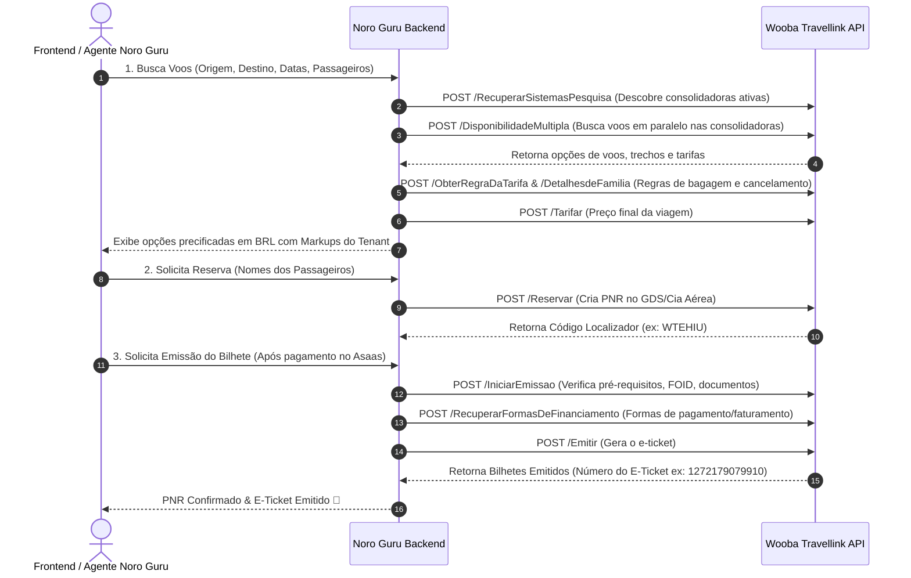

# ✈️ Wooba Travellink Web API (AIR) — Especificação Técnica de Integração

Este documento centraliza a arquitetura, autenticação, fluxo de serviços e endpoints da **Wooba Travellink (AIR API)** para integração de voos nacionais e internacionais no Noro Guru.

---

## 📌 1. Visão Geral
*   **Fornecedor**: Wooba Tecnologia / Travellink
*   **Vertical**: Passagens Aéreas (GDS, NDC, LCCs e Consolidadoras Nacionais)
*   **Consolidadoras Suportadas no Brasil**: Flytour, RexturAdvance, Ancoradouro, Esferatur, LATAM Direct, Gol, Azul, Avianca, Copa, etc.
*   **URL da Documentação Postman Oficial**: [Postman Collection - Travellink AIR API](https://documenter.getpostman.com/view/23392546/2s946pY8Vu)
*   **Adapter Key**: `wooba`

---

## 🔐 2. Autenticação e Criptografia RSA

A autenticação exige o envio de **Headers HTTP** específicos em todas as requisições:

| Header HTTP | Descrição |
|---|---|
| `Developer-Token` | Token único do desenvolvedor fornecido pelo ambiente Wooba. |
| `Developer-Access-Code` | Código de acesso gerado dinamicamente: Criptografia **RSA (PKCS1)** do formato `TOKEN\|DD/MM/YYYY` (Ex: `TESTETESTE\|08/01/2021`), convertido em **Base64**. |

### Payloads de Login (Ambiente):
Dentro do corpo JSON das chamadas, são enviadas as credenciais da agência/consolidadora:
```json
{
  "Login": "{{Login}}",
  "Senha": "{{Senha}}"
}
```

---

## 🌐 3. Ambientes e URLs de Endpoint

### Sandbox (Homologação):
*   **JSON Base Endpoint**: `https://wooba-sandbox.travellink.com.br/wcftravellinkjson/AereoNoSession.svc`
*   **XML Base Endpoint**: `https://wooba-sandbox.travellink.com.br/wcftravellink/AereoNoSession.svc`

### Produção:
*   URL fornecida pela Consolidadora/Operadora licenciada no ambiente Wooba.

---

## 🔄 4. Fluxo Completo de Reserva e Emissão de Voos (Service Flow)



---

## 🛠️ 5. Catálogo de Serviços e Endpoints

### A. Busca e Cotação de Voos

| Serviço | Endpoint REST (POST) | Descrição |
|---|---|---|
| **RecuperarSistemasPesquisa** | `/RecuperarSistemasPesquisa` | Retorna os sistemas/consolidadoras disponíveis para o par origem/destino. |
| **Disponibilidade** | `/Disponibilidade` | Consulta voos e preços segundo parâmetros da requisição. |
| **DisponibilidadeMultipla** | `/DisponibilidadeMultipla` | Consulta concorrente em múltiplos sistemas de consolidadoras simultaneamente. |
| **ObterRegraDaTarifa** | `/ObterRegraDaTarifa` | Retorna as regras de remarcação, cancelamento e franquia de bagagem. |
| **DetalhesdeFamilia** | `/DetalhesdeFamilia` | Retorna as especificações da família da tarifa (Light, Plus, Top, etc.). |
| **Tarifar** | `/Tarifar` | Retorna o valor total final exato a ser pago pela viagem completa. |

### B. Reserva e Emissão de Bilhetes

| Serviço | Endpoint REST (POST) | Descrição |
|---|---|---|
| **Reservar** | `/Reservar` | Cria a reserva no GDS/Cia Aérea e retorna o código **Localizador (PNR)**. |
| **Consultar** | `/Consultar` | Recupera as informações e status de uma reserva existente. |
| **IniciarEmissao** | `/IniciarEmissao` | Retorna pré-requisitos de emissão (FOID, documentos obrigatórios). |
| **RecuperarFormasDeFinanciamento** | `/RecuperarFormasDeFinanciamento` | Retorna formas de faturamento/financiamento permitidas para a emissão. |
| **Emitir** | `/Emitir` | Finaliza a compra e gera os números dos **E-Tickets**. |
| **ConsultarEticket** | `/ConsultarEticket` | Recupera os detalhes e números dos bilhetes eletrônicos criados. |
| **Cancelar** | `/Cancelar` | Cancela o localizador/reserva antes da emissão. |
| **CancelarEticket** | `/CancelarEticket` | Cancela o e-ticket emitido conforme regras tarifárias. |

### C. Serviços Adicionais (Assentos & Extras)

| Serviço | Endpoint REST (POST) | Descrição |
|---|---|---|
| **ObterMapaDeAssentos** | `/ObterMapaDeAssentos` | Recupera o mapa de assentos interativo do voo. |
| **MarcarAssentos** | `/MarcarAssentos` | Seleciona os assentos para os passageiros. |
| **RemoverAssentos** | `/RemoverAssentos` | Remove os assentos selecionados. |

---

## 📝 6. Exemplos de Payloads Físicos

### Exemplo: Emissão de Bilhete (`POST /Emitir`)
```json
{
  "Login": "{{Login}}",
  "Senha": "{{Senha}}",
  "Localizador": "WTEHIU",
  "Pagamento": {
    "FormaDePagamento": 1
  }
}
```

### Resposta de Sucesso (`HTTP 200 OK`):
```json
{
  "Data": "/Date(1663184805120-0300)/",
  "DataVersao": "12/09/2022",
  "SessaoExpirada": false,
  "CobrancaDeServico": null,
  "CodigoDeAutorizacao": "",
  "Bilhetes": [
    {
      "Id": 0,
      "BilheteDoInfantil": false,
      "DataDeEmissao": "/Date(-62135589600000-0300)/",
      "Numero": "1272179079910",
      "Pagamentos": null,
      "Passageiro": "PEDRO MR NASCIMENTO",
      "PassageirosAdicionais": null,
      "PaxRef": "1",
      "Status": "Ativo",
      "Voos": null
    }
  ],
  "Exception": null
}
```
