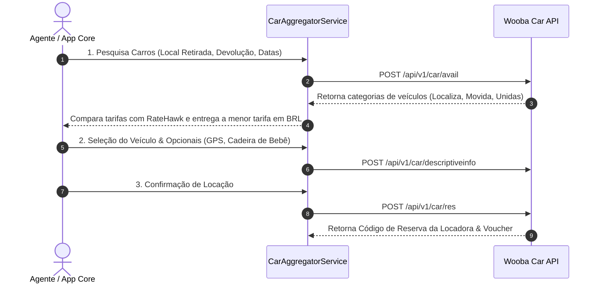

# 🚗 Wooba Travellink Web API (CARRO) — Especificação Técnica de Integração

Este documento especifica os endpoints, autenticação e fluxo de serviço da **Wooba Travellink CAR API (V2)** para aluguel de carros e locadoras nacionais (Localiza, Movida, Unidas, Hertz, etc.).

---

## 📌 1. Visão Geral
*   **Fornecedor**: Wooba Tecnologia / Travellink
*   **Vertical**: Aluguel de Carros (Car Rental Brasil e Internacional)
*   **Locadoras Nacionais Suportadas**: Localiza, Movida, Unidas, Foco, etc.
*   **URL da Documentação Postman Oficial**: [Postman Collection - Travellink CAR API](https://documenter.getpostman.com/view/24548172/2s9Y5WwNjz)
*   **Adapter Key**: `wooba_car`

---

## 🔐 2. Autenticação

Envio obrigatório nos **Headers HTTP**:

| Header HTTP | Descrição |
|---|---|
| `Developer-Token` | Token do desenvolvedor cadastrado no ambiente Wooba. |
| `Developer-Access-Code` | Código de acesso criptografado em **RSA (PKCS1)** do formato `TOKEN\|DD/MM/YYYY`, codificado em **Base64**. |

---

## 🌐 3. Ambientes e Base URLs

### Sandbox (Homologação):
*   **Endpoint Base (API V2)**: `https://wooba-sandbox.travellink.com.br/TravellinkWebApi/api/v1/car/`

### Produção:
*   URL fornecida pela consolidadora/operadora contratante.

---

## 🛠️ 4. Catálogo de Serviços e Endpoints

| Serviço | Endpoint REST | Descrição |
|---|---|---|
| **1. Pesquisa de Carros** | `POST /api/v1/car/shopping` | Retorna códigos de locais para retirada (*pickup*) e devolução (*dropoff*) do veículo. |
| **2. Avail** | `POST /api/v1/car/avail` | Pesquisa de disponibilidade de veículos nas locadoras com valores de diárias e proteções. |
| **3. Informação Descritiva** | `POST /api/v1/car/descriptiveinfo` | Detalhes específicos do veículo selecionado (categoria, ar-condicionado, transmissão, seguros inclusos). |
| **4. Res** | `POST /api/v1/car/res` | Reserva e pagamento da locação de veículo. |
| **5. Ler** | `POST /api/v1/car/read` | Leitura da reserva confirmada com voucher da locadora. |
| **6. Cancelar** | `POST /api/v1/car/cancel` | Cancelamento da reserva de veículo. |

---

## 🔄 5. Fluxo de Integração no Agregador (`CarAggregatorService`)

