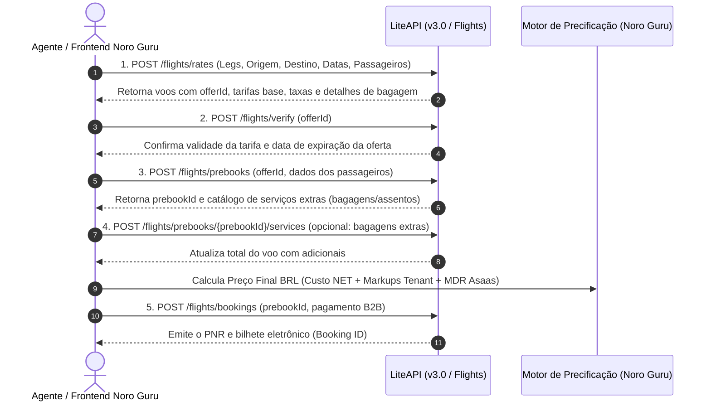

# 🔬 Análise Profunda da API & MCP Server — LiteAPI (Nuitee Connect)

**Ambiente:** Sandbox (`sand_b273758a-1ec7-492c-82b1-d356a6bcb142`)  
**MCP Server Endpoint:** `https://mcp.liteapi.travel/api/mcp?apiKey=sand_b273758a-1ec7-492c-82b1-d356a6bcb142`  
**REST API Base URL:** `https://api.liteapi.travel/v3.0`  
**Data da Análise:** 2026-07-28  

---

## 📌 1. Resumo Executivo

A **LiteAPI** (plataforma de infraestrutura de viagens da *Nuitee Connect*) evoluiu de uma API puramente hoteleira para um **ecossistema multi-vertical completo**, habilitado nativamente para **Agentes de IA** via protocolo **MCP (Model Context Protocol)**.

A plataforma expõe **69 ferramentas (tools)** estruturadas via MCP JSON-RPC 2.0 e endpoints REST v3.0, cobrindo:
1.  **Passagens Aéreas (Flights Engine GDS/NDC)**: Busca, verificação de tarifa, assentos, bagagens extras, reserva, emissão de bilhete eletrônico (PNR).
2.  **Hospedagem (Hotels & Rates)**: Busca em tempo real, menor tarifa por propriedade, pré-bloqueio (*prebook*), confirmação de reserva (*book*), alteração (*amendment*) e propostas alternativas em caso de sold-out.
3.  **Sistema de Vouchers White-Label**: Motor nativo de criação, aplicação e rastreamento de cupons/descontos (percentuais ou valor fixo) com regras de gasto mínimo.
4.  **Programa de Fidelidade (Loyalty & Points)**: Motor de cashback por tenant, saldo de pontos por hóspede e resgate de pontos (*redeem*) nas reservas.
5.  **Inteligência de Mercado & Analytics**: Relatórios de comissões, vendas por mercado emissor, nacionalidade dos hóspedes e índice de preços por cidade/hotel (*PriceIndex*).
6.  **Busca Semântica & IA Generativa**: Busca de hotéis e quartos usando linguagem natural, além de Q&A sobre detalhes da propriedade (*Ask AI Hotel*).
7.  **Cadastros Estáticos & Clima**: Previsão do tempo por coordenadas, busca de lugares (Places ID Google/OpenStreetMap), sentimentos de avaliações (*Sentiment Analysis*) e cadastros IATA globais.

---

## ✈️ 2. Vertical de Passagens Aéreas (Flights Engine GDS/NDC)

A LiteAPI oferece um motor de aéreo completo de classe GDS/NDC com **12 ferramentas dedicadas**:

### Fluxo de Reserva de Voos (End-to-End)



### Ferramentas de Aéreo Identificadas no MCP:

| Ferramenta MCP | Endpoint REST | Descrição & Funcionalidade |
|---|---|---|
| `post_flights_rates` | `POST /flights/rates` | Busca de tarifas aéreas (One-Way, Round-Trip ou Multi-City). Retorna `offerId`, discriminativo de tarifas por adulto/criança/bebê e franquia de bagagem incluída. |
| `post_flights_verify` | `POST /flights/verify` | Valida se a oferta selecionada ainda está ativa e garante que o preço NET não sofreu alteração antes da reserva. |
| `post_flights_prebooks` | `POST /flights/prebooks` | Efetua o bloqueio temporário dos lugares e vincula os nomes e dados dos passageiros (adultos, crianças, bebês). |
| `post_flights_prebooks_prebookid_services` | `POST /flights/prebooks/{id}/services` | Adiciona bagagens despachadas extras ou assentos pagos ao prebook antes da emissão. |
| `post_flights_bookings` | `POST /flights/bookings` | Finaliza a compra e emite o bilhete aéreo (PNR) via saldo B2B ou cartão. |
| `get_flights_bookings_bookingid` | `GET /flights/bookings/{id}` | Recupera os detalhes completos do bilhete aéreo emitido, trechos, e-tickets e status do PNR. |
| `get_data_flights_airlines` | `GET /data/flights/airlines` | Consulta companhias aéreas ativas e suas alianças (Star Alliance, Oneworld, SkyTeam). |
| `get_data_flights_airports` | `GET /data/flights/airports` | Busca aeroportos globais por nome, código IATA ou cidade. |

---

## 🏨 3. Vertical de Hospedagem (Hotels & Rates)

A vertical de hotéis da LiteAPI possui **18 ferramentas dedicadas** que cobrem tanto o fluxo tradicional quanto a gestão pós-venda.

### Diferenciais Importantes Identificados:
*   **Propostas Alternativas em Sold-Out (`post_bookings_bookingid_alternative_prebooks`)**: Se uma reserva sofre cancelamento ou sold-out no provedor final, a API sugere tarifas alternativas equivalentes para a mesma propriedade/datas automaticamente.
*   **Alteração de Reserva (`put_bookings_bookingid_amend`)**: Permite alterar nomes de hóspedes e observações diretamente via API sem precisar cancelar e reemitir.
*   **Menor Tarifa por Propriedade (`post_hotels_min_rates`)**: Endpoint ultra-rápido para vitrines e mapas, retornando apenas a menor tarifa de cada hotel sem carregar todos os tipos de quarto.

---

## 🎟️ 4. Sistema de Vouchers White-Label (Voucher Engine)

A LiteAPI disponibiliza um motor nativo de cupons de desconto (**7 ferramentas MCP**):

*   `post_vouchers`: Cria cupons com código customizado (`voucher_code`), tipo de desconto (`percentage` ou `fixed`), valor mínimo de compra (`minimum_spend`) e teto máximo de desconto.
*   `put_vouchers_id_status`: Ativa, pausa ou expira cupons dinamicamente.
*   `get_vouchers_history`: Histórico de resgate de vouchers por reserva e por agência.
*   `get_guests_guestid_vouchers`: Rastreia os vouchers utilizados por um hóspede específico.

> [!TIP]
> **Aplicação no Noro Guru**: Esta funcionalidade pode ser exposta diretamente no painel das Agências (Tenants) para que elas criem campanhas promocionais de vendas para seus clientes finais sem precisar desenvolver lógica de cupons do zero.

---

## 💎 5. Programa de Fidelidade & Cashback (Loyalty Engine)

A LiteAPI inclui uma suíte nativa de fidelização (**4 ferramentas MCP**):

*   `put_loyalties`: Define a taxa global de cashback (`cashbackRate`) do tenant.
*   `get_guests_guestid_loyalty_points`: Retorna o saldo de pontos acumulados de um determinado cliente/hóspede.
*   `post_guests_guestid_loyalty_points_redeem`: Efetua o resgate parcial ou total de pontos de fidelidade como desconto no valor NET da reserva.

---

## 🤖 6. Ferramentas de IA & Busca Semântica

Como a LiteAPI oferece suporte nativo ao protocolo MCP, ela inclui **4 ferramentas de IA generativa**:

*   `get_data_hotels_semantic_search`: Permite buscar hotéis por linguagem natural (Ex: *"Hotéis boutique em Miami perto da praia com vista para o mar e estacionamento"*).
*   `get_data_hotel_ask`: Faz perguntas sobre uma propriedade específica (Ex: *"O hotel aceita cachorros de grande porte e tem piscina aquecida?"*). O motor consulta a base estruturada e/ou busca na web para responder.
*   `get_data_hotels_room_search`: Filtra quartos específicos usando critérios semânticos de ambiente e amenidades.

---

## 📈 7. Inteligência de Mercado & Analytics

Possui **10 ferramentas de inteligência comercial**:

*   `getPriceIndexCity` / `getPriceIndexHotels`: Retorna a variação e tendência de preços médios por cidade ou grupo de hotéis em um período, permitindo ajustar markups de forma preditiva.
*   `post_analytics_markets`: Identifica quais países de origem geram mais reservas.
*   `get_bookings_guest_nationality_report`: Relatório de nacionalidades dos passageiros para otimização de estratégias de venda.
*   `post_commissions_report`: Relatório detalhado de comissões B2B.

---

## 🏛️ 8. Arquitetura de Integração Sugerida no Noro Guru

Para integrar a LiteAPI ao repositório do Noro Guru mantendo o padrão que estabelecemos no [supplier-adapter.ts](file:///c:/Users/paulo/0-dev/02-aplicacoes/04%20noro-guru/noro-guru/packages/lib/providers/supplier-adapter.ts):

### A. Hospedagem (`IHotelSupplierAdapter`)
Criar o arquivo `packages/lib/providers/liteapi-hotel-provider.ts` que implementa a interface `IHotelSupplierAdapter`:
*   `searchHotel()` -> Consome `POST /v3.0/hotels/rates`
*   `prebookRate()` -> Consome `POST /v3.0/rates/prebook`
*   `createBooking()` -> Consome `POST /v3.0/rates/book`
*   `getBookingInfo()` -> Consome `GET /v3.0/bookings/{id}`

### B. Passagens Aéreas (`IFlightSupplierAdapter`)
Criar uma nova interface canônica de aéreo em `packages/lib/providers/supplier-adapter.ts`:
```typescript
export interface IFlightSupplierAdapter {
  searchFlights(req: FlightSearchRequest): Promise<FlightSearchResponse>;
  verifyFlightOffer(offerId: string): Promise<FlightVerifyResponse>;
  createFlightBooking(req: CreateFlightBookingRequest): Promise<FlightBookingResponse>;
}
```
E criar a classe `LiteApiFlightProvider` em `packages/lib/providers/liteapi-flight-provider.ts`.

---

## ⚖️ 9. Comparativo Estratégico: RateHawk vs. LiteAPI

| Funcionalidade / Recurso | RateHawk (ETG) | LiteAPI (Nuitee Connect) |
|---|---|---|
| **Hospedagem (Hotéis)** | Excelente cobertura global, processo de reserva assíncrono. | Muito rápida, suporte a propostas alternativas automáticas. |
| **Passagens Aéreas (Flights)** | Requer contrato/ativação especial. | **Suíte GDS/NDC nativa** (Busca, Bagagens, Marcação e Emissão). |
| **Integração de IA (MCP)** | Não possui MCP Server nativo. | **Possui MCP Server nativo** (`https://mcp.liteapi.travel/api/mcp`). |
| **Motor de Vouchers** | Não disponível via API. | **Nativo** (Criação, regras e resgate de cupons). |
| **Programa de Fidelidade** | Não disponível via API. | **Nativo** (Acúmulo e resgate de pontos por cliente). |
| **Busca Semântica por IA** | Não disponível. | **Nativo** (`semantic_search` e `hotel_ask`). |
| **Previsão do Tempo & Price Index**| Não disponível via API. | **Nativo** (`get_data_weather` e `getPriceIndexCity`). |

---

> [!NOTE]
> **Conclusão da Análise**: A LiteAPI é uma das APIs de viagens mais modernas do mercado. A combinação de **Aéreo + Hotéis + Vouchers + Fidelização + MCP Server para IA** permite que o Noro Guru expanda suas capacidades para além de hospedagem sem precisar de múltiplos fornecedores adicionais para cupons ou voos.
