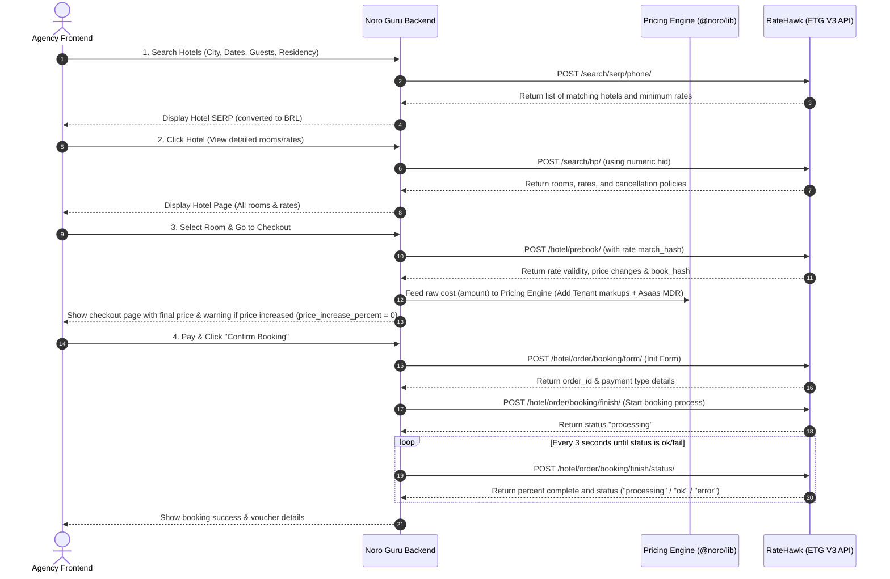

# 🚀 Emerging Travel Group (ETG / RateHawk) B2B API Certification Submission

**Partner Name:** Noro Guru
**Integration Stage:** Pre-Certification
**Authentication Key ID:** 203 (Sandbox)
**Submission Date:** 2026-07-28

---

## 📋 Part 1: Pre-Certification Checklist Responses

### General

#### 1. Map Test Hotels
*   *Requirement:* Please map the test hotel, hid = 8473727 or id = “test_hotel_do_not_book”. This is mandatory.
*   **Answer:**
    *   [x] Mapped test hotel `hid = 8473727` / `"test_hotel_do_not_book"` in our static catalog database.
    *   [x] Mapped test hotel `hid = 10004834` (Conrad Los Angeles) for all multiroom and child-related booking integration scenarios.

#### 2. Product Type for Certification
*   *Requirement:* Please specify what partner’s product is going to be certified, and indicate if the necessary access / materials have been provided.
*   **Answer:**
    *   [x] **Access to the website has been provided.**
        *   *Staging/Sandbox URL:* `https://staging.noroguru.com` (Outbound IPs will be whitelisted on both ends).
    *   [x] **API Logs of 1 completed test booking provided** (See Part 3 of this document).

#### 3. Payment Types
*   *Requirement:* Please choose what kind of payment types you will use.
*   **Answer:**
    *   [x] **“deposit”** (The payment is deducted from Noro Guru's B2B deposit account/credit line. Traveler payment is collected locally on our end via **Asaas** gateway, keeping credit card data out of scope for the ETG API).
    *   [ ] “hotel”
    *   [ ] “now”

#### 4. IP Whitelisting on ETG End
*   *Requirement:* Please provide the list of your IP addresses that need to be whitelisted.
*   **Answer:**
    *   [x] **Server Outbound IPs:** (To be provided securely in the email header / tickets).

---

### Integration Architecture and Workflows

#### 1. API Call Sequence
We utilize a **3-step search & reservation flow** to guarantee rate validation and hold inventory before booking.



---

#### 2. Workflow Endpoint Mapping

| Step | User Action / Trigger | ETG API Endpoint |
|---|---|---|
| **1. Destination Search** | User searches destination city/region | `/search/multicomplete/` |
| **2. Hotel Search (SERP)** | User queries regional hotel availability | `/search/serp/region/` or `/search/serp/hotels/` |
| **3. Hotel Tariff Details** | User views hotel room rates | `/search/hp/` |
| **4. Pre-booking Validation** | User clicks room selection for checkout | `/hotel/prebook/` |
| **5. Create Booking Process** | User clicks confirm reservation | `/hotel/order/booking/form/` |
| **6. Start Booking Process** | Backend sends passenger & payment details | `/hotel/order/booking/finish/` |
| **7. Check Booking Status** | Backend polls for reservation success | `/hotel/order/booking/finish/status/` |
| **8. Retrieve Order Details** | Backend fetches final voucher & details | `/hotel/order/info/` |
| **9. Cancel Reservation** | Administrator cancels booking | `/hotel/order/booking/cancel/` (when applicable) |

---

### Static Data Updates
*   **Update Frequency:** Full dump weekly (via `/hotel/info/dump/`), incremental updates daily (via `/hotel/info/incremental_dump/`).
*   **Realtime Enrichment:** Content API is used to fetch static hotel details (images, descriptions) in realtime if a hotel ID is missing in our local database cache.
*   **Destination Mapping:** Destinations are updated weekly via the regions dump file (`/serp/region`).
*   **Hotel Rules Display:** We display all information from `metapolicy_struct` and `metapolicy_extra_info` dynamically on the checkout page.

---

### Booking Parameters & Timeouts
*   **Prebook Price Check:** `price_increase_percent` is set to `0` (we reject any supplier price increases and ask for confirmation).
*   **Connection Timeouts:**
    *   Search HP timeout: **15 seconds**
    *   Prebook timeout: **30 seconds**
    *   Finish booking timeout: **60 seconds**
*   **Cancellation Timezone:** Cancellation deadlines are converted from UTC+0 and displayed in the traveler's local timezone.
*   **Residency:** Guest residency (`residency` parameter) is requested at the first search step and sent in all subsequent requests.

---

## 📊 Part 2: Multibooking Scenario Details

As required for partners supporting multiroom bookings, here are the details of our certified sandbox test order:

*   **Test Hotel (HID):** 10004834 (Conrad Los Angeles)
*   **Rooms Configured:** 2 Rooms
    *   *Room 1:* 2 Adults + 1 Child (5 y.o)
    *   *Room 2:* 2 Adults
*   **Check-in:** 2026-07-29
*   **Check-out:** 2026-08-01
*   **Guest Residency:** `uz` (Uzbekistan)
*   **Partner Order ID:** `NORO-TEST-175434`
*   **RateHawk Order ID:** **`100040755`**
*   **Booking Status:** **Completed (Success)**

---

## 📃 Part 3: Step-by-Step API Request & Response Logs

Below are the raw request/response logs from our successful sandbox booking.

### Step 1: Retrieve Rates / Search Hotel Page (`POST /search/hp/`)
*   **Endpoint:** `https://api-sandbox.worldota.net/api/b2b/v3/search/hp/`
*   **Request JSON:**
```json
{
  "hid": 10004834,
  "checkin": "2026-07-29",
  "checkout": "2026-08-01",
  "residency": "uz",
  "language": "en",
  "guests": [
    {
      "adults": 2,
      "children": [5]
    },
    {
      "adults": 2,
      "children": []
    }
  ]
}
```
*   **Response JSON (Truncated for brevity):**
```json
{
  "status": "ok",
  "data": {
    "hotels": [
      {
        "id": "conrad_los_angeles",
        "hid": 10004834,
        "rates": [
          {
            "book_hash": "h-b9d74b62-eb86-402e-b5cb-03039ad3088e",
            "match_hash": "m-68cf17f5-f75e-58f8-82ee-eb41464f45ae",
            "daily_prices": [
              "354.00",
              "354.00",
              "354.00"
            ],
            "meal": "nomeal",
            "meal_data": {
              "value": "nomeal",
              "has_breakfast": false,
              "no_child_meal": true
            },
            "payment_options": {
              "payment_types": [
                {
                  "amount": "1062.00",
                  "show_amount": "1062.00",
                  "currency_code": "USD",
                  "show_currency_code": "USD",
                  "type": "deposit",
                  "vat_data": {
                    "included": true,
                    "applied": true,
                    "amount": "106.20",
                    "currency_code": "USD",
                    "value": "106.20"
                  }
                }
              ]
            }
          }
        ]
      }
    ]
  },
  "error": null
}
```

---

### Step 2: Rate Validation & Prebook (`POST /hotel/prebook/`)
*   **Endpoint:** `https://api-sandbox.worldota.net/api/b2b/v3/hotel/prebook/`
*   **Request JSON:**
```json
{
  "hash": "h-b9d74b62-eb86-402e-b5cb-03039ad3088e",
  "price_increase_percent": 0
}
```
*   **Response JSON (Truncated):**
```json
{
  "status": "ok",
  "data": {
    "hotels": [
      {
        "id": "conrad_los_angeles",
        "hid": 10004834,
        "rates": [
          {
            "book_hash": "p-b9d74b62-eb86-402e-b5cb-03039ad3088e",
            "match_hash": "m-68cf17f5-f75e-58f8-82ee-eb41464f45ae",
            "payment_options": {
              "payment_types": [
                {
                  "amount": "1062.00",
                  "currency_code": "USD",
                  "type": "deposit"
                }
              ]
            }
          }
        ]
      }
    ]
  },
  "error": null
}
```

---

### Step 3: Create Booking Process Form (`POST /hotel/order/booking/form/`)
*   **Endpoint:** `https://api-sandbox.worldota.net/api/b2b/v3/hotel/order/booking/form/`
*   **Request JSON:**
```json
{
  "partner_order_id": "NORO-TEST-175434",
  "book_hash": "p-b9d74b62-eb86-402e-b5cb-03039ad3088e",
  "language": "en",
  "user_ip": "127.0.0.1"
}
```
*   **Response JSON:**
```json
{
  "status": "ok",
  "data": {
    "order_id": 100040755,
    "partner_order_id": "NORO-TEST-175434",
    "item_id": 100040755,
    "payment_types": [
      {
        "amount": "1062.00",
        "currency_code": "USD",
        "is_need_credit_card_data": false,
        "is_need_cvc": false,
        "type": "deposit",
        "recommended_price": null
      }
    ],
    "is_gender_specification_required": false,
    "upsell_data": []
  },
  "error": null
}
```

---

### Step 4: Finish Booking Process (`POST /hotel/order/booking/finish/`)
*   **Endpoint:** `https://api-sandbox.worldota.net/api/b2b/v3/hotel/order/booking/finish/`
*   **Request JSON:**
```json
{
  "partner": {
    "partner_order_id": "NORO-TEST-175434",
    "comment": "Multiroom test booking"
  },
  "user": {
    "email": "corporate-agency@noroguru.com",
    "phone": "+5511999999999"
  },
  "language": "en",
  "rooms": [
    {
      "guests": [
        {
          "first_name": "Paulo",
          "last_name": "Bolliger"
        },
        {
          "first_name": "Maria",
          "last_name": "Bolliger"
        },
        {
          "first_name": "Pedro",
          "last_name": "Bolliger",
          "is_child": true,
          "age": 5
        }
      ]
    },
    {
      "guests": [
        {
          "first_name": "Jose",
          "last_name": "Silva"
        },
        {
          "first_name": "Ana",
          "last_name": "Silva"
        }
      ]
    }
  ],
  "payment_type": {
    "type": "deposit",
    "amount": "1062.00",
    "currency_code": "USD"
  }
}
```
*   **Response JSON:**
```json
{
  "status": "processing",
  "data": null,
  "error": null
}
```

---

### Step 5: Check Status Polling (`POST /hotel/order/booking/finish/status/`)
*   **Endpoint:** `https://api-sandbox.worldota.net/api/b2b/v3/hotel/order/booking/finish/status/`
*   **Request JSON:**
```json
{
  "partner_order_id": "NORO-TEST-175434"
}
```
*   **Response JSON (Final Attempt - 100% complete):**
```json
{
  "status": "ok",
  "data": {
    "data_3ds": null,
    "partner_order_id": "NORO-TEST-175434",
    "percent": 100,
    "prepayment": null
  },
  "error": null
}
```

---

### Step 6: Retrieve Booking Details (`POST /hotel/order/info/`)
*   **Endpoint:** `https://api-sandbox.worldota.net/api/b2b/v3/hotel/order/info/`
*   **Request JSON:**
```json
{
  "search": {
    "partner_order_ids": [
      "NORO-TEST-175434"
    ]
  },
  "ordering": {
    "ordering_type": "desc",
    "ordering_by": "created_at"
  },
  "pagination": {
    "page_size": 10,
    "page_number": 1
  }
}
```
*   **Response JSON:**
```json
{
  "status": "ok",
  "data": {
    "current_page_number": 1,
    "total_orders": 2,
    "total_pages": 1,
    "found_orders": 1,
    "found_pages": 1,
    "orders": [
      {
        "agreement_number": "B2B-15010",
        "amount_payable": {
          "amount": "1062.00",
          "currency_code": "USD"
        },
        "amount_sell": {
          "amount": "1062.00",
          "currency_code": "USD"
        },
        "checkin_at": "2026-07-29",
        "checkout_at": "2026-08-01",
        "created_at": "2026-07-28T20:44:01",
        "hotel_data": {
          "id": "conrad_los_angeles",
          "hid": 10004834
        },
        "nights": 3,
        "order_id": 100040755,
        "order_type": "hotel",
        "status": "completed",
        "payment_data": {
          "payment_type": "deposit",
          "invoice_id_v2": "15010-00002",
          "payment_due": "2026-07-31"
        },
        "partner_data": {
          "order_id": "NORO-TEST-175434"
        }
      }
    ]
  },
  "error": null
}
```
