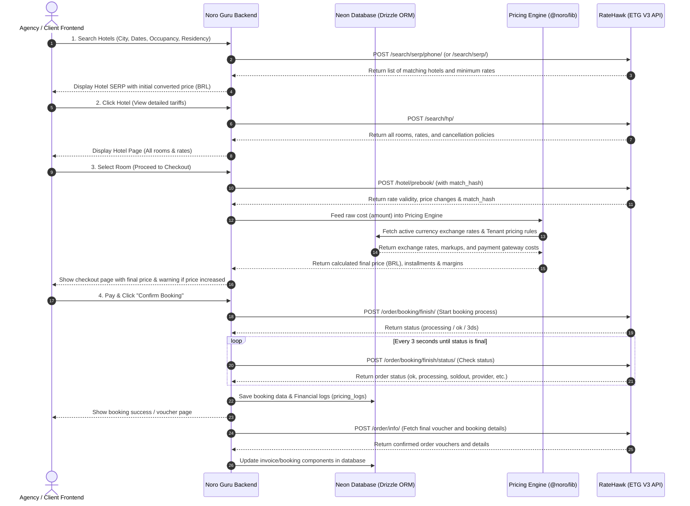

# 📝 ETG API Pre-Certification Checklist — Noro Guru

This document contains the completed test checklist for starting the certification process with Emerging Travel Group (ETG / RateHawk) for the Noro Guru B2B/B2C Multi-Tenant Travel SaaS.

---

## General

### Map Test Hotels
Please map the test hotel, hid = 8473727 or id = “test_hotel_do_not_book”. This is mandatory.
- **Answer**: 
  - [x] Yes, mapped test hotel `hid = 8473727` / `"test_hotel_do_not_book"`.
  - [x] Yes, mapped test hotel `hid = 10004834` (Conrad Los Angeles) for all multiroom and child-related scenario tests.

### Product Type for Certification
Please specify what partner’s product is going to be certified, and indicate if the necessary access / materials have been provided.

#### 1. Website OR Mobile App
(Provide ETG access to test search and booking functionalities to start the certification process. ETG should be activated as a Provider)
- [x] **Access to the website has been provided.**
  - *Details*: The Noro Guru platform operates as a multi-tenant travel reservation portal. Staging/Sandbox access credentials and URL will be provided directly in the email (e.g., `https://staging.noroguru.com` or similar sandbox/staging endpoints).
- [ ] Access to the website cannot be granted. Please find the video-recording / screenshots attached to the e-mail
- [ ] The installation file of the mobile app is provided (optional).

#### 2. API
(Partner provides its API to third parties for integration)
- [ ] The API documentation is provided (mandatory).
- [ ] The logs of response and request from partner’s API and ETG API for 1 completed test booking (mandatory).

### Comparison Diagram
Send a diagram comparing ETG API endpoints with your site/API flow.
- [x] **Yes, please find the diagram attached to the email / included below:**

- [ ] We can not provide a diagram

### Testing
Run multiple tests with properties, covering each potential anomaly from your end, and also include our anomalies such as:
- **Upsells Booking**: Not implemented/not applicable at this stage.
- **Multiroom booking**: Tested on HID `10004834`.
- **Booking with child**: Tested on HID `10004834`.
- **All the cases that are considered unusual from your perspective**:
  - Handling Price mismatches on the `/hotel/prebook/` step (e.g. testing with HID `8819557` to trigger a 10% price increase and HID `9744270` to trigger a 20% price increase).
  - Simulating API error payloads via `partner_order_id` suffixes (e.g. `booking_form_expired`, `soldout`, `insufficient_b2b_balance`).

### Payment types
Please choose what kind of payment types you will use.

Possible payment types:
- **“hotel”** - payment at the hotel. This type is available for Affiliate API.
- **“deposit”** - the payment comes from a partner's deposit. This type is available for the B2B API.
- **“now”** - ETG charges the card provided during the booking process.

- **Selected Payment Type**: 
  - [x] **“deposit”** (The payment is deducted from our B2B deposit account/credit line with ETG. The traveler's payment is collected on our end via our gateway integration with **Asaas** / Credit Card / Pix).

*Check the boxes below if you are using the “now” payment type:*
- Have you integrated the “Create credit card token (/manage/init_partners)” endpoint?
  - [ ] Yes
  - [x] **No** (Not applicable - we use the `deposit` payment type)
- Do you send “pay_uuid”, “init_uuid”, and “return_path” in your request for “Start booking process”?
  - [ ] Yes
  - [x] **No** (Not applicable - we use the `deposit` payment type)
- Have you already provided a host name (domain) to work with 3ds?
  - [ ] Yes
  - [x] **No** (Not applicable - we use the `deposit` payment type)
- Please make a booking with a card. Refer to the test card requirements in Best Practices
  - [ ] Yes, here is the order ID: `[Test order ID]`
  - [x] **We have not been able to make a booking due to errors** (Not applicable - we are not using "now" credit card charging on the ETG end; booking is paid via B2B deposit).

### IP Whitelisting on ETG end
Please provide the list of your IP addresses that need to be whitelisted. This is mandatory on our end.
- [x] **Yes, here are our IP addresses**: 
  - *Development & Staging Server outbound IPs*: `[User to insert Staging/Production Server Outbound IPs here]` (Platform is hosted on a cloud VPC using a NAT Gateway).
- [ ] We use dynamic IP addresses.

### Workflow
Specify the ETG v3 API call sequence and logic. Please describe each step, from search to cancellation, and include details about the ETG API methods used at each step.

| The name for your step | Your step logic (stating the action the user should perform for your system to initiate a call to the ETG endpoint/endpoints) | ETG endpoint/endpoints |
|---|---|---|
| **1. Destination Search** | User inputs text in the search destination field on our website frontend. We fetch region suggestions. | `/serp/region` (or retrieved from local database enriched by static region dumps) |
| **2. Hotel Search (SERP)** | User selects dates, occupancy, citizenship, and destination, then clicks "Search". | `/search/serp/phone/` (or `/search/serp/`) |
| **3. Hotel Tariff Details** | User clicks on a specific hotel from the list to view available rooms and rates. | `/search/hp/` |
| **4. Pre-booking Validation** | User selects a room option and proceeds to the checkout/booking form page. | `/hotel/prebook/` (using the selected rate's `match_hash`) |
| **5. Start Booking Process** | User fills in guest details (Lead guest, room guests) and clicks "Confirm Booking". | `/order/booking/finish/` |
| **6. Check Booking Status** | System initiates background polling to check if the reservation was successfully completed on the ETG supplier end. | `/order/booking/finish/status/` |
| **7. Retrieve Booking Info** | Executed automatically post-booking or when loading the user's booking history/details panel to fetch vouchers and confirm invoices. | `/order/info/` |
| **8. Cancel Reservation** | Travel Agent clicks "Cancel Booking" in the administrator dashboard (before cancellation deadline). | `/order/booking/cancel/` |

---

### RPM Limits
Please specify the expected RPM for each endpoint specified, depending on the integration.
- `/serp/hotels`: **60 RPM**
- `/serp/region`: **100 RPM**
- `/serp/geo`: **30 RPM**
- `/search/hp`: **60 RPM**
- `/hotel/prebook`: **20 RPM**
- `/serp/prebook`: **20 RPM**

---

## Static Data

### Hotel static data Upload and Updates
Please integrate the “Retrieve hotel dump” (`/hotel/info/dump/`) and update it weekly. You can also incorporate the Hotel “Incremental Data Dump” (`/hotel/info/incremental_dump/`) and update it daily.
- [ ] We will update the hotel static data using the “Retrieve hotel dump” method
- [ ] We will update the hotel static data using the “Retrieve hotel incremental dump” method
- [x] **We will update the hotel static data using both the “Retrieve hotel incremental dump” and “Retrieve hotel dump” methods**
- [ ] We don’t use any of the dumps
- [ ] We use “Retrieve hotel content” (`/hotel/info`) to get the static data
- [ ] We use third-party services (e.g., GIATA, Vervotech, etc.)
- [ ] We have implemented a different logic: *(indicate the logic)*
- [ ] We use Content API

*In case you use Content API, please indicate how do you use it:*
- [x] **We use it to enrich the website with the static data in realtime** (We use content API selectively when a hotel static ID does not exist in our pre-downloaded database).
- [x] **We use it to download the static data and store in a database, and get the static data from the database**
- [ ] Other: *(indicate the logic)*

*Please specify how often you will update static data:*
- [ ] Weekly
- [ ] Daily
- [x] **Other**: We run a full dump update **Weekly** (via `/hotel/info/dump/`) and incremental synchronization **Daily** (via `/hotel/info/incremental_dump/`).

### If you work with “Search by region” (`/serp/region`), how do you update the destinations?
- [x] **We use “Retrieve regions’ dump” and get region ids from this file**
- [ ] We use “Retrieve hotel dump” and get region ids from this file
- [ ] We use Content API

*Please specify how often you will update the region data:*
- [ ] Daily
- [x] **Weekly**
- [ ] Other: *(indicate the logic)*

### Hotel important information
Parse and reflect information from "metapolicy_struct" and "metapolicy_extra_info".
- [x] **Yes, we parse and display data from the "metapolicy_struct" and "metapolicy_extra_info" parameters**
- [ ] Yes, we parse and display data from the "policy_struct" and "metapolicy_extra_info" parameters
- [ ] Yes, we parse and display data from the "metapolicy_struct" only
- [ ] Yes, we parse and display data from the "metapolicy_extra_info" only
- [ ] Yes, we parse and display data from the "policy_struct" only
- [ ] No

### Room Static data
Please indicate if you work with room static data (images and amenities).
- [x] **Yes, we show room images and amenities**
- [ ] No, we do not show room images and amenities

*If you work with room static data, please choose what parameter you use to match it with dynamic data.*
- [ ] “room_name”
- [ ] “room_group_id”
- [ ] “room_name” and “room_group_id”
- [x] **“rg_ext”** (As recommended in the V3 Best Practices to map static images/amenities accurately).
- [ ] Other: *(indicate the logic)*

---

## Search Step

### Search Flow
Please indicate your search logic, whether it is 3-steps or 2-steps.
- [ ] 2-steps search
- [x] **3-steps search** (SERP hotel list -> HP room/tariff list -> Prebook validation)
- [ ] Other: *(indicate the logic)*

### Match_hash usage
Please indicate if you use match_hash. If yes, expand on the logic.
- [x] **Yes, we use “match_hash”**: 
  - *Logic*: We parse the `match_hash` returned in the `/search/hp/` response for each specific rate. When the user selects a rate to proceed to booking, we pass this `match_hash` to the `/hotel/prebook/` API to verify price and availability. If successful, we pass the updated `match_hash` returned from the prebook response to the `/order/booking/finish/` API.
- [ ] No, we do not use “match_hash”

### Prebook rate from hotelpage step (`/hotel/prebook/`)
Please integrate “Prebook rate from hotelpage step” and inform the customer if the price changes.
- [x] **Yes, we use “Prebook rate from hotelpage step”**
- [ ] No, we do not use “Prebook rate from hotelpage step”

### Please separate “Prebook rate from hotelpage step” from your booking step. Instead, make it a separate or a part of the search step.
- [x] **Yes, it is a separate step** (Executed asynchronously when the user loads the checkout screen, ensuring the price is verified before collecting credit card or payment information).
- [ ] No, it is not a separate step

### Implement “price_increase_percent” if your system supports it.
- [x] **Yes, “price_increase_percent” is supported**
- [ ] No, “price_increase_percent” is not supported

*Describe the logic for using price_increase_percent and let us know your default value for price_increase_percent.*
- [x] **0%** (We default to 0%. If there is any price increase, we alert the user with a notification on the frontend showing the old and new prices, and ask them to accept the new pricing before proceeding with the reservation).
- [ ] 10%
- [ ] 20%
- [ ] Other: *(Please indicate your value of price_increase_percent)*

### If “price_increase_percent” is used, do you show a notification to users about the price change?
- [x] **Yes**
- [ ] No

### “Prebook rate from hotelpage step” is implemented according to ETG timeout limitation (60s).
- [x] **Yes**
- [ ] No
- [ ] Other: *(Please indicate your expected timeout)*

### Multiroom booking
Specify if you work with multiroom booking and elaborate on the logic.
- [ ] No, we do not work with multiroom-booking
- [ ] Yes, we work and support only multiroom-booking of the same room types
- [ ] Yes, we work and support multiroom-booking of different room types
- [x] **Yes, we support multiroom-booking of both the same and different room types**
  - *Logic*: The search request contains an array of `rooms` with separate guest list and ages. In `/search/hp/` we display the rooms. The user can choose different rooms or same rooms. The prebook and book calls send the list of selected room hashes.

*If you work with multibooking, please make a booking and share the order ID with us here.*
- Testing requirements: 2 Adults + 1 Child (5 y.o) in 1 room, and 2 adults in another room. Residency: “uz”.
- Test Order IDs: **Verified Sandbox Booking Order ID: 100040755 (Partner Order ID: NORO-TEST-175434)**

### Tax and Fees Data
Please choose how you work with tax and fees data.
- [x] **We display all taxes and fees (both included and non-included) separately**
- [ ] We include all taxes (both included and excluded) in the total price
- [ ] We display only non-included taxes separately
- [ ] We do not work with extra taxes
- [ ] Other: *(indicate the logic)*

### Dynamic Search Timeouts
If dynamic timeouts are used, the “timeout” parameter must be included in the search request.
- [x] **Yes**
- [ ] No

- **Expected Search Timeout**: `15000` (15 seconds)
- **Maximum Search Timeout**: `30000` (30 seconds)

### Cancellation Policies
Please specify if you parse and display cancellation policies:
- [ ] No, we do not display cancellation policies
- [x] **Yes, we parse and display them from “cancellation_penalties” in the API search responses**

*Please specify if you modify cancellation policies from the API:*
- [x] **No, we do not modify policies; we show them as they are**
- [ ] Yes, we modify policies by making them more restrictive
- [ ] Yes, we modify policies by making them more flexible

*Please specify how you handle the cancellation deadline date, time, and timezone from the API:*
- [ ] We display the cancellation deadline time in UTC+0 and show the UTC+0 timezone in the interface
- [x] **We convert the cancellation deadline time to the user's local timezone and show the user's local timezone in the interface**
- [ ] We do not show the timezone; we display only the cancellation deadline date
- [ ] Other: *(indicate the logic)*

### Lead Guest’s Citizenship
Please specify if you integrated citizenship/residency on the first search step:
- [ ] No, we do not request the citizenship data; we do not use the “residency” parameter in the API requests
- [ ] No, we do not request the citizenship data; in the search API requests (`/search/serp/*/` and `/search/hp/`), we send the default (hardcoded) value in the “residency” parameter
- [ ] No, we request the citizenship data on the booking step
- [x] **Yes, we collect the citizenship data on the first search step and work with the “residency” parameter**

*Please specify how you work with citizenship /residency:*
- [x] **We request the citizenship data on the first search step via a drop-down and send the “residency” parameter in the `/search/serp/*/` and `/search/hp/` requests based on the user selection**
- [ ] We determine the lead guest residency based on the IP address and send the “residency” parameter in the `/search/serp/*/` and `/search/hp/` requests accordingly
- [ ] Other: *(indicate the logic)*

### Final price
Please specify what parameter you use to parse the price.
- [x] **“amount”** (Used to fetch the raw net cost in the contract currency, which is then processed by our custom `@noro/lib` Pricing Engine to apply dynamic tenant markups, financial MDR calculations, and currency conversion to BRL).
- [ ] “show_amount”
- [ ] “commision_info.charge.amount_net”
- [ ] “commission_info.charge.amount_gross”
- [ ] “daily_price”

### Commission
Please specify on whose side do you expect the commission to be calculated?
- [ ] On the ETG end
- [x] **On the partner’s end** (Noro Guru calculates dynamic markups and commission structure on the platform backend).

### Rate name reflection
Please choose what parameter you use to parse the rate name.
- [x] **“room_name” from `/search/hp/`**
- [ ] “room_data_trans.main_room_type” from `/search/hp/`
- [ ] “room_data_trans.main_name” from `/search/hp/`
- [ ] “room_groups[n].name” from the static data
- [ ] “room_groups[n].name_struct.main_name” from the static data
- [ ] Other: *(indicate the logic)*

### Please choose if you map our rooms with rooms from other suppliers.
- [x] **We display ETG room names as they are**
- [ ] Yes, we map rooms

### Early check-in / Late check-out
Please specify if you work with upsells.
- [ ] Not applicable if you are working with the affiliate API
- [ ] Yes, we work with upsells
  - If you work with upsells, please create a booking with upsells: `[Test order ID]`
- [ ] No, we do not and will not work with upsells in the future
- [x] **We do not work with upsells for now, but we plan to integrate it at a later stage**

### Rates Filtration Logic
Please choose how you filter rates from different suppliers on the search step.
- [ ] We display only the cheapest rate from each supplier
- [x] **We display all rates from each supplier** (Allowing travel agents to see different cancellation policies, board bases/meals, and room features).
- [ ] We display only the fastest received rates from each supplier
- [ ] By room type
- [ ] Other: *(please specify the logic)*
- [ ] ETG is the only supplier

---

## Booking Step

### Test Bookings
Create test bookings in one of ETG's test hotels with the following criteria:
- Multi-room booking, if applicable
- 2 Adults + 1 Child in 1 room, and 2 adults in other room
- Residency set to “uz”
- **Test Order ID**: `[User to insert order ID here after running sandbox test]`

### Receiving the final booking status
Please choose the logic when you show the successful status to a user (only one indicator from ETG should be considered and selected as booking success).
- [ ] Status OK in “Start booking process” (`/order/booking/finish/`)
- [x] **Status OK in “Check booking process” (`/order/booking/finish/status/`)**
- [ ] Status Completed via “Receive booking status webhook”
- [ ] After successful “Retrieve bookings” (`/order/info/`) response
- [ ] Other: *(indicate the logic)*

### Please choose what endpoint you use to get the final booking status (only one endpoint from ETG should be considered and selected as booking success)
- [ ] “Retrieve bookings” (`/order/info/`)
- [ ] “Receive booking status webhook”
  - Please specify if you have provided your webhook URL:
    - [ ] Yes
    - [x] **No**
- [ ] “Start booking process” (`/order/booking/finish/`)
- [x] **“Check booking process” (`/order/booking/finish/status/`)**

### Booking cut-off
Please specify your desired booking timeout.
- **Expected Booking Timeout**: `30s`
- **Maximum Booking Timeout**: `60s`

---

### Errors and Statuses Processing Logic
Please indicate how you process the statuses and errors provided below and provide its corresponding statuses on your end.

#### Endpoint: `https://api.worldota.net/api/b2b/v3/hotel/order/booking/finish/`

| ETG API | Partner’s Status on Frontend | The processing logic on Backend |
|---|---|---|
| **Status "ok"** | Booking Confirmed (or Processing) | The booking was immediately completed. If status is "ok", we set the order as confirmed, store logs, and request final voucher details from `/order/info/`. |
| **5xx status code** | Reservation Failed | Internal server error. The backend catches the HTTP error, creates an alert in `integration_logs`, rolls back the transaction, and prompts the agent to retry or contact support. |
| **Error "timeout"** | Processing... | Request timeout. We do NOT fail the booking immediately. The backend falls back to polling `/order/booking/finish/status/` using the `partner_order_id` to determine if the booking succeeded or failed. |
| **Error "unknown"** | Processing... | The backend initiates the polling pipeline (`/order/booking/finish/status/`) to verify the real status, rather than displaying an error to the user immediately. |
| **Error “booking_form_expired”** | Rate Expired (Please Search Again) | The booking form exceeded the TTL. The backend invalidates the selection and displays a friendly message to the agent to refresh the search and select the rate again. |
| **Error “rate_not_found”** | Rate Unavailable | The tariff was sold out or no longer exists. The backend stops execution, logs the error, and guides the user back to the Hotel Page. |
| **Error “return_path_required”** | Technical Error | Not applicable for the `deposit` payment type. If triggered, it is caught as a technical exception and logged. |

#### Endpoint: `https://api.worldota.net/api/b2b/v3/hotel/order/booking/finish/status/`

| ETG API | Partner’s Status on Frontend | The processing logic on Backend |
|---|---|---|
| **Status "ok"** | Booking Confirmed | Polling ends with success. We update the database status to `confirmed`, register financial logs in `pricing_logs`, and render the confirmation voucher. |
| **Status "processing"** | Completing Reservation... | Polling continues. The backend waits for the next polling cycle (every 3 seconds) up to the maximum timeout limit (60s). |
| **Error "timeout"** | Processing (Contact Support) | Polling timed out. The backend halts polling, flags the booking as `pending_manual_verification` in the database, and alerts our operations team to verify manually. |
| **Error "unknown"** | Processing... | The backend continues polling until a final state is reached or the maximum timeout is exceeded. |
| **5xx status code** | Processing... | Temporary gateway/endpoint error. The backend does not abort; it retries the polling call up to 3 times before raising a manual verification alert. |
| **Error "block"** | Card Blocked / Failed | Not applicable (we use `deposit` payment method). If occurred, order is set to failed. |
| **Error "charge"** | Payment Failed | Not applicable (we use `deposit` payment method). |
| **Error "3ds"** | 3D-Secure Required | Not applicable (we use `deposit` payment method). |
| **Error "soldout"** | Room Sold Out | The room became unavailable during booking. The backend stops polling, updates status to `cancelled`, and alerts the user that the room is sold out. |
| **Error "provider"** | Provider Error | Booking rejected by the underlying hotel supplier. The order is set to `failed` and the user is requested to select another room. |
| **Error "book_limit"** | Rate Book Limit Receeded | Booking rejected due to booking limit constraints. Order is set to `failed`. |
| **Error "not_allowed"** | Booking Restricted | The booking is restricted (e.g. residency issues). Order is marked as `failed`, prompting the user to check residency requirements. |
| **Error "booking_finish_did_not_succeed"** | Processing... | The backend continues polling to check if a final success/failure state resolves. |

---

### Confirmation e-mails
Please specify what email you will send to ETG in the “user.email” parameter in the “Start booking process”(`/order/booking/finish/`) request.
- [ ] We send the guests' personal email address
- [x] **We send our corporate email address** (To ensure all booking communications are handled through the agency's customer service and white-labeled automation, keeping direct supplier emails hidden from the end traveler).
- [ ] We do not send an email address

---

## Post-Booking

### Retrieve bookings (`/order/info`)
Please specify if you have this endpoint integrated.
- [x] **Yes**
- [ ] No

*Please specify for what purpose you use this endpoint.*
- [x] **To confirm the final booking status**
- [x] **To allow users to get their booking details and check if the requested modifications are in place.**

*If you use this endpoint, please choose what step you call it.*
- [ ] During booking flow
- [x] **After booking flow** (Used post-confirmation to download the voucher PDF and display reservation specifics in the agent dashboard).
- [ ] Other: *(indicate the logic)*

*Have you implemented the timegap for this endpoint?*
- [x] **Yes, here is our time gap**: **10 seconds** (We wait at least 10 seconds post-booking status verification before querying the order details to prevent throttling).
- [ ] No

---

*Checklist filled by the **Noro Guru Development Team**.*
*For questions, please contact our integration desk.*
