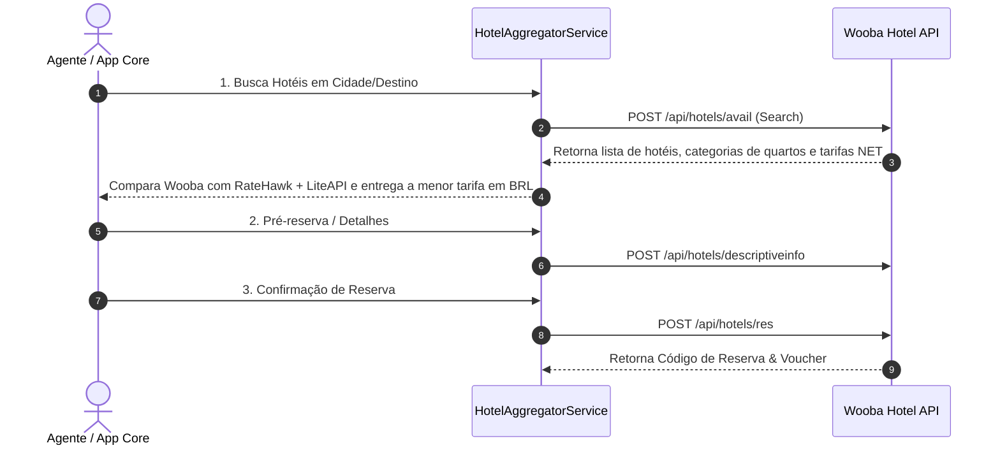

# 🏨 Wooba Travellink Web API (HOTEL) — Especificação Técnica de Integração

Este documento especifica os endpoints, autenticação e fluxo de serviço da **Wooba Travellink HOTEL API** para inventário nacional de hotéis e pousadas.

---

## 📌 1. Visão Geral
*   **Fornecedor**: Wooba Tecnologia / Travellink
*   **Vertical**: Hospedagem / Hotéis (Brasil e América Latina)
*   **URL da Documentação Postman Oficial**: [Postman Collection - Travellink HOTEL API](https://documenter.getpostman.com/view/23357974/2s7YYvbhkN)
*   **Adapter Key**: `wooba_hotel`

---

## 🔐 2. Autenticação

Envio obrigatório nos **Headers HTTP**:

| Header HTTP | Descrição |
|---|---|
| `Developer-Token` | Token do desenvolvedor cadastrado no ambiente Wooba. |
| `Developer-Access-Code` | Código de acesso criptografado em **RSA (PKCS1)** do formato `TOKEN\|DD/MM/YYYY`, codificado em **Base64**. |

---

## 🌐 3. Ambientes e Base URLs

### Sandbox (Homologação):
*   **Endpoint Base**: `https://wooba-sandbox.travellink.com.br/TravellinkWebapi/api/hotels/`

### Produção:
*   URL fornecida pela consolidadora/operadora contratante.

---

## 🛠️ 4. Catálogo de Serviços e Endpoints

| Serviço | Endpoint REST | Descrição |
|---|---|---|
| **1. Destinations** | `POST /api/hotels/destinations` | Retorna as cidades e IDs de destinos disponíveis no inventário. |
| **2. Avail** | `POST /api/hotels/avail` | Pesquisa a disponibilidade de quartos, tarifas e planos de refeição segundo datas/hóspedes. |
| **3. Descriptive Info** | `POST /api/hotels/descriptiveinfo` | Retorna detalhes completos do hotel, fotos, comodidades e descrição da acomodação. |
| **4. Res** | `POST /api/hotels/res` | Criação da reserva e confirmação do pagamento do quarto selecionado. |
| **5. Read** | `POST /api/hotels/read` | Leitura e consulta do voucher da reserva de hotel criada. |
| **6. Cancel** | `POST /api/hotels/cancel` | Cancelamento da reserva de hotel conforme regras de penalidade. |

---

## 🔄 5. Fluxo de Integração no Agregador (`HotelAggregatorService`)

