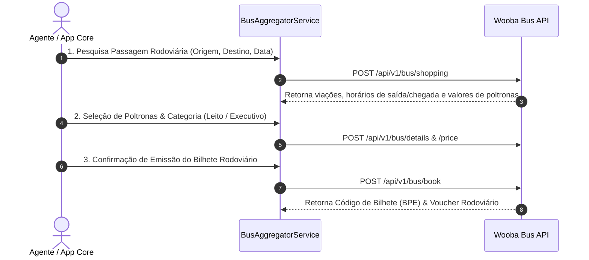

# 🚌 Wooba Travellink Web API (ÔNIBUS / RODOVIÁRIO) — Especificação Técnica de Integração

Este documento especifica os endpoints, autenticação e fluxo de serviço da **Wooba Travellink BUS API** para integração de passagens de ônibus rodoviários no Brasil.

---

## 📌 1. Visão Geral
*   **Fornecedor**: Wooba Tecnologia / Travellink
*   **Vertical**: Transporte Rodoviário / Passagens de Ônibus
*   **Viação / Empresas Suportadas**: Principais empresas de ônibus rodoviários do Brasil (Cometa, 1001, Gontijo, Catarinense, Guanabara, Garcia, Eucatur, etc.).
*   **URL da Documentação Postman Oficial**: [Postman Collection - Travellink BUS API](https://documenter.getpostman.com/view/24547348/2sAYJ7fyrA)
*   **Adapter Key**: `wooba_bus`

---

## 🔐 2. Autenticação

Envio obrigatório nos **Headers HTTP**:

| Header HTTP | Descrição |
|---|---|
| `Developer-Token` | Token do desenvolvedor cadastrado no ambiente Wooba. |
| `Developer-Access-Code` | Código de acesso criptografado em **RSA (PKCS1)** do formato `TOKEN\|DD/MM/YYYY`, codificado em **Base64**. |

---

## 🌐 3. Ambientes e Base URLs

### Sandbox (Homologação):
*   **Endpoint Base**: `https://wooba-sandbox.travellink.com.br/TravellinkWebApi/api/v1/bus`

### Produção:
*   URL fornecida pela consolidadora/operadora contratante.

---

## 🛠️ 4. Catálogo de Serviços e Endpoints

| Serviço | Endpoint REST | Descrição |
|---|---|---|
| **1. Locations** | `POST /api/v1/bus/locations` | Retorna todas as rodoviárias e pontos de partida/chegada disponíveis. |
| **2. Shopping** | `POST /api/v1/bus/shopping` | Pesquisa de horários de ônibus, trechos, viações e tarifas rodoviárias. |
| **3. Details** | `POST /api/v1/bus/details` | Detalhes da viagem selecionada (tipo de poltrona: Convencional, Executivo, Leito, Leito-Cama, mapa de assentos). |
| **4. Price** | `POST /api/v1/bus/price` | Tarifação exata do valor final incluindo taxas de embarque rodoviárias. |
| **5. Book** | `POST /api/v1/bus/book` | Criação da reserva e confirmação da passagem rodoviária. |
| **6. Retrieve** | `POST /api/v1/bus/retrieve` | Consulta e recuperação do bilhete de passagem eletrônica (BPE) / voucher rodoviário. |
| **7. Cancel** | `POST /api/v1/bus/cancel` | Cancelamento do bilhete rodoviário conforme regras da viação. |

---

## 🔄 5. Fluxo de Integração Rodoviária

