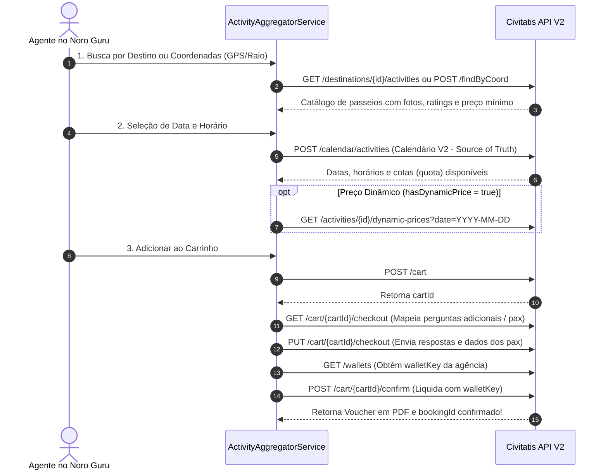

# 🎟️ Civitatis API (V2 / V3) — Especificação Técnica de Integração

Este documento especifica a arquitetura de integração, autenticação, modelos de disponibilidade e fluxo de reservas para **Passeios, Excursões, Ingressos e Transfers V3** da **Civitatis** no motor do Noro Guru.

---

## 📌 1. Visão Geral
*   **Fornecedor**: Civitatis (Civitatis Tourismo S.L.)
*   **Vertical**: Passeios, Atividades, Ingressos, Excursões e Transfers (V3)
*   **Documentação Oficial**: `https://api.civitatis.com/docs/es/v2`
*   **Adapter Key**: `civitatis`

---

## ✉️ 5. Histórico de Contato Comercial (Adriana Rodrigues - Civitatis B2B)

* **Contato Civitatis**: Adriana Rodrigues de Aquino (`agencias.br@civitatis.com` | +55 21 9 7276 9984)
* **ID da Agência**: `75308` (`KILIG EXPERIENCIAS SAO INS`)

### Questionário Respondido:
1. **Agências/Usuários Conectados**: Dezenas de agências no ecossistema SaaS multi-tenant Noro Guru.
2. **Faturamento Transacionado Projetado**: R$ 2,5M a R$ 5M/mês globalmente.
3. **Expectativa Civitatis**: R$ 150k a R$ 300k/mês nos primeiros 90 dias (250 a 500 reservas/mês).
4. **Fornecedores Já Integrados**: RateHawk, LiteAPI, Hotelbeds APItude, TeamAmerica NY, Wooba Travellink e TripAdvisor.
5. **Previsão de Início**: Imediato (Motor Noro Guru 100% pronto para homologação da API V3).

---

## 🌐 2. Ambientes e Endpoints Base

| Ambiente | Base URL |
|---|---|
| **Sandbox (Testes)** | `https://sandbox-api.civitatis.com/v2` |
| **QA** | `https://api-qa.civitatis.com/v2` |
| **Produção** | `https://api.civitatis.com/v2` |

---

## 🔐 3. Autenticação

### 1. Geração de Token JWT
A autenticação exige um `POST` no endpoint `/auth` enviando as credenciais da conta Civitatis da agência.

* **Endpoint**: `POST /auth`
* **Payload**:
  ```json
  {
    "username": "USUARIO_CIVITATIS",
    "password": "SENHA_CIVITATIS"
  }
  ```
* **Resposta (200 OK)**:
  ```json
  {
    "token": "JWT_TOKEN_STRING",
    "expiresIn": "2026-07-30T10:00:00+01:00"
  }
  ```

### 2. Header Obrigatório em todas as Requisições
Todas as chamadas seguintes devem enviar o header HTTP:
`Authorization: Bearer {token}`

---

## 🔄 4. Fluxo Completo de Reserva de Passeios & Atividades



---

## 🚗 5. Fluxo de Transfers V3 (Novo Padrão Recomendado)

O novo fluxo **Traslados V3** elimina a necessidade de mapeamento prévio de zonas, permitindo cotar diretamente via **Código IATA**, **Google Place ID** ou **Coordenadas GPS**.

1. **Cotar Options**: `POST /v3/transfers/quotes`
   * Suporta `ONE_WAY` (Só ida) ou `ROUND_TRIP` (Ida e volta em uma única chamada).
   * Retorna `quote_id` com tempo de expiração (`expires_at`) e `booking_requirements`.
2. **Criar Reserva**: `POST /v3/transfers/bookings`
   * Envia `quote_id`, dados do titular e detalhes de voo/hotel.
   * Retorna `cart_id`.
3. **Pagar/Confirmar**: `POST /cart/{cartId}/confirm`
   * Envia `walletKey` para emitir o voucher do transfer.

---

## 🧪 6. Ferramentas para Teste em Ambiente Sandbox

Para testar a integração E2E em Sandbox sem risco de esgotamento de vagas:
* **Endpoint de Disponibilidade Infinita**: `GET /activities/infinite-availability`
  * Retorna uma lista de passeios com vagas e horários sempre liberados para homologação.
