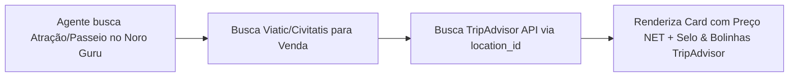

# 🦉 TripAdvisor Content API — Especificação Técnica de Integração

Este documento especifica a arquitetura de integração, autenticação por API Key e consumo de **Avaliações, Ratings (Bolinhas Verdes), Selos e Fotos** da **TripAdvisor Content API** no motor do Noro Guru.

---

## 📌 1. Visão Geral
*   **Fornecedor**: TripAdvisor (TripAdvisor LLC)
*   **Vertical**: Prova Social, Reviews, Ratings, Selos *Travellers' Choice* e Fotos de Viajantes
*   **Documentação Oficial**: `https://developer-tripadvisor.com/content-api/`
*   **Adapter Key**: `tripadvisor`

---

## 🌐 2. Ambientes e Base URL

| Ambiente | Base URL / Server |
|---|---|
| **Produção / REST API** | `https://api.content.tripadvisor.com/api/v1` |
| **MCP Server Oficial (JSON-RPC / SSE)** | `https://docs.terra.tripadvisor.com/mcp` |

---

## 🔐 3. Autenticação

A autenticação é realizada via parâmetro na Query String HTTP `key` enviado em cada chamada:

```http
GET https://api.content.tripadvisor.com/api/v1/location/search?key=f6abb31a-7b05-4d04-bc27-21aa63507efa&searchQuery=Eiffel+Tower&language=pt
```

### Variável de Ambiente Configurada:
*   `TRIPADVISOR_API_KEY=f6abb31a-7b05-4d04-bc27-21aa63507efa` (salva em [`.env.local`](file:///c:/Users/paulo/0-dev/02-aplicacoes/04%20noro-guru/noro-guru/.env.local#L94-L95))

---

## 🛠️ 4. Principais Endpoints Mapeados

### 1. Pesquisa de Localização / POI (`location/search`)
*   **Endpoint**: `GET /location/search`
*   **Parâmetros**: `key`, `searchQuery`, `category` (`attractions`, `hotels`, `restaurants`), `language` (`pt`)
*   **Objetivo**: Localizar o `location_id` de uma atração, hotel ou passeio no banco do TripAdvisor.

### 2. Detalhes do Local & Avaliações (`location/{location_id}/details`)
*   **Endpoint**: `GET /location/{location_id}/details`
*   **Retorno**: `rating` (ex: `4.5`), `num_reviews`, `rating_image_url` (imagem oficial das bolinhas verdes) e selos de premiação (`awards`).

### 3. Comentários de Viajantes (`location/{location_id}/reviews`)
*   **Endpoint**: `GET /location/{location_id}/reviews`
*   **Retorno**: Lista de depoimentos reais de viajantes com texto, nota individual e data.

### 4. Fotos da Comunidade (`location/{location_id}/photos`)
*   **Endpoint**: `GET /location/{location_id}/photos`
*   **Retorno**: Fotos reais enviadas pelos usuários em alta resolução.

---

## 💡 5. Como o Noro Guru Exibe o Conteúdo do TripAdvisor


