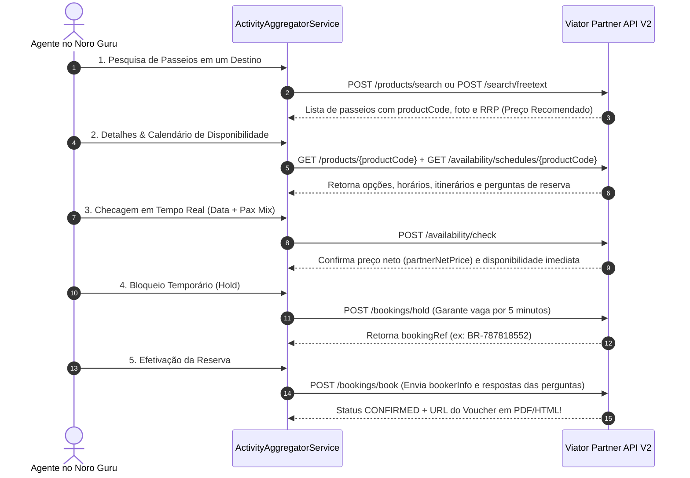

# 🗿 Viator Partner API v2 (TripAdvisor) — Especificação Técnica de Integração

Este documento especifica a arquitetura de integração, autenticação, catálogo de passeios e fluxo de reservas para **Passeios, Atrações, Ingressos e Experiências Globais** da **Viator (Grupo TripAdvisor)** no motor do Noro Guru.

---

## 📌 1. Visão Geral
*   **Fornecedor**: Viator (TripAdvisor, Inc.)
*   **Vertical**: Passeios, Ingressos de Atrações, Excursões e Experiências Internacionais
*   **Documentação Oficial**: `https://docs.viator.com/partner-api/technical/`
*   **Adapter Key**: `viator`

---

## 📘 5. Resumo do Guia Técnico Oficial Viator (Travel Commerce Partner API v2)

Link Oficial: `https://partnerresources.viator.com/travel-commerce/technical-guide/`

### A. Fluxo de Integração Recomendado (Merchant API):
1. **Catalog Sync**: Download/Sync do catálogo de 300.000+ produtos da Viator via `/partner/products/search` e `/partner/products/{productCode}`.
2. **Disponibilidade em Tempo Real**: `POST /partner/availability/check` (valida preços e horários exatos para a data desejada).
3. **Trava de Carrinho (Hold)**: `POST /partner/bookings/hold` (reserva temporária do produto durante a digitação dos dados do passageiro no checkout).
4. **Confirmação & Emissão de Vouchers**: `POST /partner/bookings/book` (emissão instantânea de ingressos e vouchers com código QR / PDF).

### B. Modelo Comercial Merchant:
* O **Noro Guru** recebe o pagamento do cliente em Reais (BRL) via gateway interno, paga o valor NET à Viator e retém a margem de comissão/markup configurada no Control Plane.

---

## 🌐 2. Ambientes e Base URLs

| Ambiente | Base URL |
|---|---|
| **Sandbox (Testes)** | `https://api.sandbox.viator.com/partner` |
| **Produção** | `https://api.viator.com/partner` |

---

## 🔐 3. Autenticação e Headers HTTP

Todas as requisições para a Viator exigem os seguintes **Headers HTTP**:

| Header HTTP | Exemplo / Valor Exigido | Descrição |
|---|---|---|
| `exp-api-key` | `xxxxxxxx-xxxx-xxxx-xxxx-xxxxxxxxxxxx` | Chave de API única da organização. |
| `Accept` | `application/json;version=2.0` | **Obrigatório**. Versão 2.0 da API. |
| `Accept-Language` | `pt-BR` (ou `en-US`, `es-ES`) | Idioma das descrições e títulos. |
| `Accept-Encoding` | `gzip` | Suporte a compressão (Recomendado). |

---

## 👥 4. Faixas Etárias (`ageBands`) e Pax Mix

A Viator classifica os passageiros em **6 categorias de faixas etárias** configuradas por passeio:

| Code (`ageBand`) | Descrição |
|---|---|
| `ADULT` | Adulto |
| `CHILD` | Criança |
| `INFANT` | Bebê / Colo |
| `YOUTH` | Jovem |
| `SENIOR` | Sênior / Idoso |
| `TRAVELER` | Categoria única para passeios precificados por grupo/unidade (`UNIT`) |

---

## 🔄 5. Fluxo Completo de Reserva de Passeios & Atrações

---

## 🛠️ 6. Principais Endpoints Mapeados

### A. Catálogo e Busca de Produtos
*   `POST /products/search`: Busca produtos com filtros de tags, duração, avaliação e idioma do guia.
*   `GET /products/{product-code}`: Retorna ficha técnica completa (itinerários estruturados, inclusões, cancelamentos e fotos).
*   `POST /search/freetext`: Busca inteligente por texto livre e pontos de interesse.

### B. Disponibilidade e Tarifação em Tempo Real
*   `GET /availability/schedules/{product-code}`: Retorna o calendário de temporadas operacionais.
*   `POST /availability/check`: Validação instantânea de disponibilidade para data, horário e composição de passageiros (`paxMix`).

### C. Reservas e Bloqueios
*   `POST /bookings/hold`: Reserva temporária de tarifa e inventário (Hold de 5 minutos).
*   `POST /bookings/book`: Efetivação da reserva com dados dos passageiros e geração de Voucher em PDF.
*   `GET /bookings/status`: Consulta de status da reserva (`CONFIRMED`, `PENDING`, `CANCELLED`).

### D. Cancelamentos e Reembolsos
*   `GET /bookings/{booking-reference}/cancel-quote`: Cotação de regras de reembolso prévias ao cancelamento.
*   `POST /bookings/{booking-reference}/cancel`: Efetivação do cancelamento com motivo formal.
