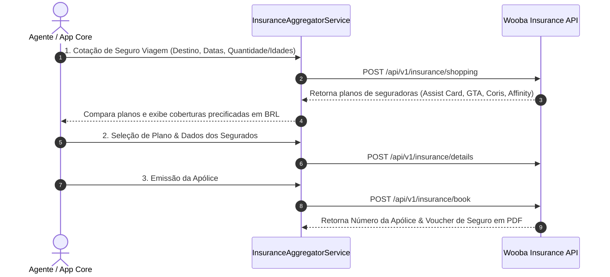

# 🛡️ Wooba Travellink Web API (SEGURO VIAGEM) — Especificação Técnica de Integração

Este documento especifica os endpoints, autenticação e fluxo de serviço da **Wooba Travellink INSURANCE API** para cotação e emissão de apólices de Seguro Viagem nacional e internacional.

---

## 📌 1. Visão Geral
*   **Fornecedor**: Wooba Tecnologia / Travellink
*   **Vertical**: Seguro Viagem (Travel Insurance)
*   **Seguradoras Suportadas**: Assist Card, GTA, Universal Assistance, Affinity, Coris, Vital Card, etc.
*   **URL da Documentação Postman Oficial**: [Postman Collection - Travellink INSURANCE API](https://documenter.getpostman.com/view/24547348/2sB2j1iYgV)
*   **Adapter Key**: `wooba_insurance`

---

## 🔐 2. Autenticação

Envio obrigatório nos **Headers HTTP**:

| Header HTTP | Descrição |
|---|---|
| `Developer-Token` | Token do desenvolvedor cadastrado no ambiente Wooba. |
| `Developer-Access-Code` | Código de acesso criptografado em **RSA (PKCS1)** do formato `TOKEN\|DD/MM/YYYY`, codificado em **Base64**. |

---

## 🌐 3. Ambientes e Base URLs

### Sandbox (Homologação):
*   **Endpoint Base**: `https://wooba-sandbox.travellink.com.br/TravellinkWebApi/api/v1/insurance`

### Produção:
*   URL fornecida pela consolidadora/operadora contratante.

---

## 🛠️ 4. Catálogo de Serviços e Endpoints

| Serviço | Endpoint REST | Descrição |
|---|---|---|
| **1. Destinations** | `POST /api/v1/insurance/destinations` | Retorna as regiões cobertas (Europa / Tratado de Schengen, América do Norte, América do Sul, Brasil, Ásia, etc.). |
| **2. Shopping** | `POST /api/v1/insurance/shopping` | Cotação de planos de seguro viagem conforme datas da viagem, idades dos passageiros e destino. |
| **3. Details** | `POST /api/v1/insurance/details` | Detalhes e condições gerais das coberturas (Despesas Médicas/Hospitalares, Cobertura COVID-19, Extravio de Bagagem, Regresso Sanitário). |
| **4. Book** | `POST /api/v1/insurance/book` | Emissão da apólice de seguro com dados completos dos segurados (CPF, Data de Nascimento, Contato de Emergência). |
| **5. Retrieve** | `POST /api/v1/insurance/retrieve` | Consulta e download do voucher/apólice de seguro emitida. |
| **6. Cancel** | `POST /api/v1/insurance/cancel` | Cancelamento de apólice de seguro emitida antes do início da viagem. |

---

## 🔄 5. Fluxo de Integração no Agregador (`InsuranceAggregatorService`)

