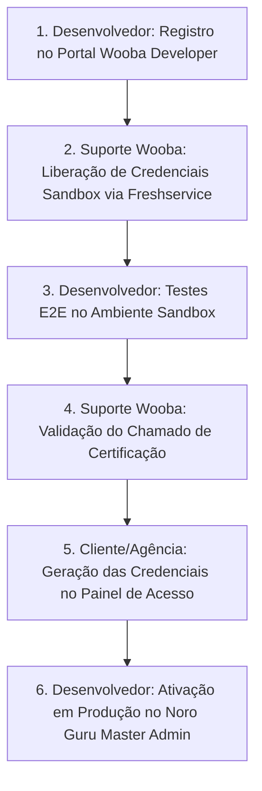

# 🚀 Wooba Travellink — Guia de Onboarding, Homologação e Certificação (Passo a Passo)

Este documento detalha o processo oficial de **Onboarding de Desenvolvedor, Solicitação de Credenciais Sandbox e Certificação para Produção** no ecossistema da **Wooba Tecnologia**.

---

## 📌 1. Registro como Desenvolvedor (Concluído)

1. **Acesso ao Portal**: [https://developer.wooba.com.br/developer/register](https://developer.wooba.com.br/developer/register)
2. **Formulário Preenchido**: Dados da `NORO TECNOLOGIA E TURISMO LTDA` (CNPJ `63.429.497/0001-88`).
3. **APIs Selecionadas**:
   * `Travellink API Air` (Aéreo)
   * `Travellink API Hotel` (Hospedagem)
   * `Travellink API Sales` (Backoffice/Webhooks)
   * `Travellink API Car` (Locadoras)
   * `Travellink API Bus` (Rodoviário)
   * `Travellink API Insurance` (Seguro Viagem)

---

## 🔧 2. Homologação (Solicitação de Credenciais Sandbox)

Para receber o `Developer Token` e as credenciais de teste de cada API:

### Passo a Passo no Support Desk Freshservice:
1. Acesse o Portal de Suporte da Wooba: [https://wooba.freshservice.com/support/home](https://wooba.freshservice.com/support/home)
2. **Primeiro Acesso**: Clique em **"Recuperar senha"** utilizando o e-mail da empresa cadastrado no desenvolvedor (`contato@noroguru.com` / `guru@nomade.guru`).
3. Acesse **Solicitar um Serviço**.
4. Siga o caminho:  
5. **Status dos Chamados Enviados no Freshservice** (Em Andamento 🟡):
   * **#SR-74468**: Solicitação de Developer Token & Onboarding
   * **#SR-74469**: API AÉREO (Flytour / Kilig Experiencias SAO INS 34143.6)
   * **#SR-74470**: API HOTEL (Flytour / Kilig Experiencias SAO INS 34143.6)
   * **#SR-74471**: API CARRO (Flytour / Kilig Experiencias SAO INS 34143.6)
   * **#SR-74472**: API RODOVIÁRIO (Flytour / Kilig Experiencias SAO INS 34143.6)
   * **#SR-74473**: API SEGURO VIAGEM (Flytour / Kilig Experiencias SAO INS 34143.6)

---

## ✅ 3. Certificação e Liberação de Produção

Após realizar os testes no ambiente Sandbox:

1. **Formulário de Certificação**: [https://wooba.freshservice.com/a/catalog/request-items/31](https://wooba.freshservice.com/a/catalog/request-items/31)
2. **Informação do Endpoint**:
   * Informar no formulário:  
     `"Usaremos o conteúdo através da URL: https://app.noro.guru"`
3. **Geração de Credenciais de Produção**:
   * Após a aprovação técnica da Wooba, acesse o painel de agência/consolidadora da Wooba.
   * Vá em: `Painel de Acessos > Travellink API > Credencial`
   * Selecione os produtos certificados (Aéreo, Hotel, Carro, Ônibus, Seguro).
   * Gere o `Login`, `Senha` e configure a `Notification Url` do Webhook:  
     `https://core.noroguru.com/api/webhooks/wooba`

---

## 📊 Fluxograma de Perfis e Responsabilidades

