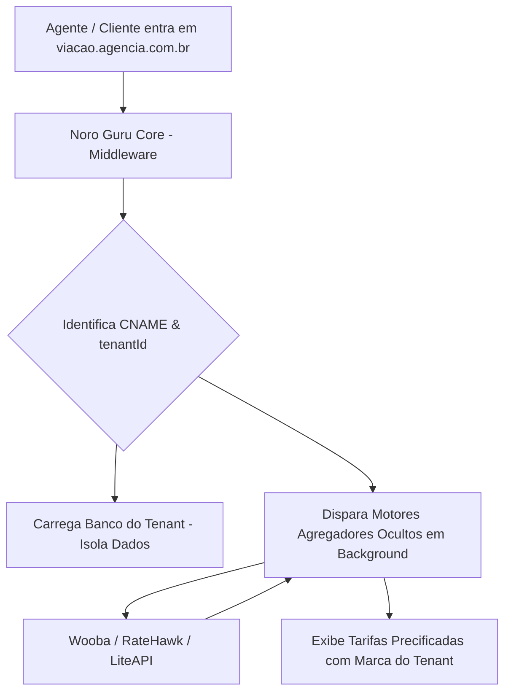

# 🏛️ Referência de Arquitetura Multi-Loja & Domínios Customizados (Noro Guru Master)

Este documento analisa a especificação técnica da **Travellink Api - OTA** (`https://documenter.getpostman.com/view/45687227/2sB34ZqPn7`) como **modelo de referência de arquitetura** para a gestão de Tenants, Domínios Customizados (CNAMEs) e Escopos de Usuário no **Noro Guru Control Plane (`apps/control`)**.

---

## 📌 1. Preceito Fundamental do Noro Guru
> 🚨 **REGRA DE ARQUITETURA INVIOLÁVEL**:
> **Nenhum Tenant (agência ou cliente final) do Noro Guru sabe ou saberá da existência da Wooba, RateHawk, LiteAPI ou de qualquer outro fornecedor.**
>
> O Noro Guru é uma plataforma **100% White-Label e Abstrata**. Toda a inteligência de fornecedores roda 100% oculta no Backend Master do Noro Guru.

---

## 🔍 2. O que a `Travellink Api - OTA` ensina para a nossa Arquitetura?

Essa API expõe a estrutura usada para gerenciar **Múltiplas Lojas (Stores), Domínios Customizados e Permissões por Escopo de Loja**:

1. **Gestão de Domínios Customizados (CNAMEs)**:
   * Como a plataforma mapeia domínios de clientes (`agencia.com.br`) para um identificador de loja (`StoreId`).
   * No Noro Guru, aplicamos essa mesma técnica com o **Cloudflare Provider** e a tabela `custom_domains` do PostgreSQL.

2. **Permissões de Usuário por Escopo de Tenant (`tenantId` / `StoreId`)**:
   * Usuários com acesso restrito a 1 loja específica vs. Administradores com acesso global a múltiplos contextos de loja.
   * No Noro Guru, usamos o `tenantId` no banco de dados para garantir o isolamento total de dados entre os tenants.

3. **Criação e Gestão de Contas de Clientes por Loja**:
   * Endpoint de provisionamento de usuários no escopo da loja.

---

## 🛠️ 3. Como o Backend Master do Noro Guru Utilizará Essa Referência

