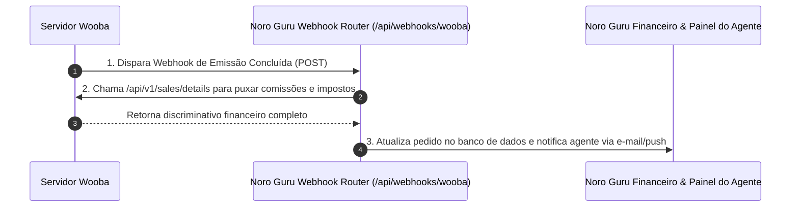

# 🔔 Wooba Travellink API Sales & Webhooks — Referência Interna de Conciliação

> 🚨 **DOCUMENTO DE REFERÊNCIA TÉCNICA INTERNA (NORO GURU MASTER)**
> **PREMISSA DE PRODUTO INVIOLÁVEL**: Nenhum tenant (agência ou cliente final) tem ou terá acesso/conhecimento deste fornecedor. Este documento serve **exclusivamente como referência técnica interna para a equipe de engenharia do Noro Guru e conciliação do nosso backend central**.

---

## 📌 1. Visão Geral
*   **Nome da API**: Wooba Travellink API Sales
*   **Objetivo**: Recebimento de Webhooks de emissão/mudança e conciliação de faturamento/comissões no Noro Guru.
*   **URL da Documentação Postman Oficial**: [Postman Collection - Travellink Sales API](https://documenter.getpostman.com/view/23357974/2s7YYvbhkP)

---

## 🔔 2. Webhooks de Notificação Passiva

Sempre que ocorrer uma emissão, alteração ou cancelamento de bilhete na Wooba, o servidor deles dispara uma requisição `POST` automática para a URL configurada do Noro Guru.

### Configuração da URL de Notificação:
1. Acessar o Painel Wooba da Agência/Consolidadora.
2. Ir em: `Painel > Travellink Api > Credenciais > Notification Url`.
3. Cadastrar a URL de Webhook do Noro Guru:
   `https://core.noroguru.com/api/webhooks/wooba`

### Payload do Webhook Recebido (`POST`):
```json
{
  "Api": "Travellink-ApiSales",
  "TransactionType": 2,
  "TransactionTypeDescription": "Hotel",
  "Id": 12050,
  "UniqueId": "HTL-CE569F58-962A-4B3C-9320-A269AE8AF5B2",
  "Locator": "PV_HTL-67AC9A90D5",
  "Ticket": "1272179079910",
  "LastUpdate": "11/11/2022 14:57:17"
}
```

---

## 🛠️ 3. Endpoints da API Sales (`/api/v1/sales/`)

| Endpoint REST | Método | Descrição |
|---|---|---|
| `/api/v1/sales/details` | `POST` | Retorna o detalhamento financeiro completo da venda (taxas de embarque, impostos, faturamento e comissões da agência). |
| `/api/v1/sales/list` | `POST` | Listagem e pesquisa de todas as vendas por período, passageiro ou localizador para conciliação. |
| `/api/v1/sales/change` | `POST` | Consulta histórico de alterações e remarcações em vendas existentes. |

---

## 💡 4. Como o Noro Guru Utilizará Essa API


