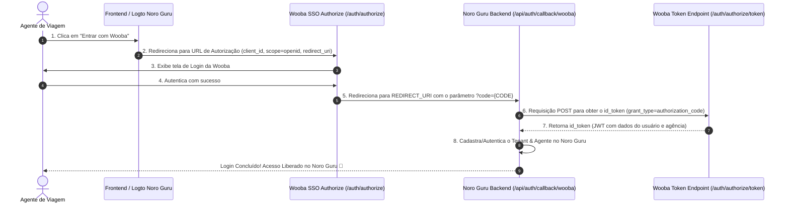

# 🔐 Wooba Travellink API — SSO (Estudo de Referência de Autenticação)

> 🚨 **DOCUMENTO DE REFERÊNCIA TÉCNICA INTERNA (NORO GURU MASTER)**
> **PREMISSA DE PRODUTO INVIOLÁVEL**: Nenhum tenant (agência ou cliente final) tem ou terá acesso/conhecimento deste fornecedor. Este documento é mantido **estritamente como referência de arquitetura OAuth2/OIDC para estudo interno da nossa equipe de engenharia do Noro Guru**.

---

## 📌 1. Visão Geral
*   **Nome da API**: Travellink API – SSO
*   **Protocolo**: OpenID Connect (OIDC) / OAuth 2.0 (`authorization_code` flow)
*   **URL da Documentação Postman Oficial**: [Postman Collection - Travellink SSO API](https://documenter.getpostman.com/view/24548172/2s9XxvTEhD)

---

## 💡 2. Benefícios Estratégicos para o Noro Guru

1. **Login com 1-Clique ("Entrar com Wooba")**:
   Agentes e agências de viagens que possuem conta na Wooba podem se autenticar no Noro Guru usando o mesmo usuário e senha do portal Wooba.
2. **Onboarding Instantâneo de Tenants**:
   Ao realizar o login via SSO, a Wooba devolve um token JWT (`id_token`) contendo todos os dados cadastrais da agência (CNPJ, Razão Social, Nome Fantasia, Logotipo, Endereço e Código do ERP/Backoffice). O Noro Guru usa essas informações para **cadastrar e configurar o Tenant da agência em segundos**.

---

## 🔄 3. Fluxo de Autenticação OAuth2 / OIDC



---

## 🛠️ 4. Endpoints e Requisições

### A. URL de Redirecionamento (Passo 1):
`GET https://wooba-sandbox.travellink.com.br/Agencias30/auth/authorize?client_id={CLIENT_ID}&response_type=code&scope=openid&redirect_uri={REDIRECT_URI}`

### B. Obtenção do `id_token` (Passo 3):
`POST https://wooba-sandbox.travellink.com.br/Agencias30/auth/authorize/token`

**Headers:**
*   `Authorization`: `Basic Base64({CLIENT_ID}:{CLIENT_SECRET})`
*   `Content-Type`: `application/json` ou `application/x-www-form-urlencoded`

**Payload JSON:**
```json
{
  "grant_type": "authorization_code",
  "client_id": "{{client_id}}",
  "client_secret": "{{client_secret}}",
  "code": "{{code}}",
  "redirect_uri": "{{redirect_uri}}"
}
```

---

## 🔑 5. Estrutura do JWT (`id_token` Claims)

A Wooba devolve os seguintes dados protegidos dentro do token JWT:

### User Claims:
*   `sub`: ID único do usuário na Wooba.
*   `email`: E-mail do usuário.
*   `name`: Nome completo.
*   `role`: Perfil de acesso (Interno/Externo).
*   `phone_number`: Telefone de contato.

### Agency Claims (Dados da Agência / Tenant):
*   `agencyid`: ID da Agência na Wooba.
*   `agencydocument`: CNPJ da Agência.
*   `agencybackofficecode`: Código no ERP/Backoffice (`IdERP`).
*   `ragencyname`: Razão Social.
*   `agencybusinessname`: Nome Fantasia.
*   `agencylogoUrl`: URL da Logomarca da Agência (para aplicar White-Label no Noro Guru).
*   `agencyaddress1`, `agencyneighborhood`, `agencycity`, `agencystate`, `agencyzipCode`, `agencycountry`.
